# Kryptonian Alphabet

> Source: [https://www.dcode.fr/kryptonian-alphabet](https://www.dcode.fr/kryptonian-alphabet)
> Retrieved: 2026-08-08
> Attribution: dCode.fr (CC BY notice on the source page).
> Reference-only extract: no converter, solver, API, or implementation code.

## What is Kryptonian Alphabet? (Definition)

The Kryptonian alphabet is a fictional script developed for the TV series Smallville, meant to represent the script of the planet Krypton where Superman is from.

## How to write in Kryptonian?

Kryptonian writing is a substitution of numbers and letters used in French/English. The alphabet correspondence table is:

A B C D E F G H I J K L M N O P Q R S T U V W X Y Z dCode.fr

A B C D E F G H I J K L M N O P Q R S T U V W X Y Z dCode.fr

Example: SUPERMAN ils translated

The symbols for the digits are:

0 1 2 3 4 5 6 7 8 9 dCode.fr

0 1 2 3 4 5 6 7 8 9 dCode.fr

## How to decrypt Kryptonian language?

Kryptonian decryption is a substitution of Kryptonian symbols with the corresponding letter or number.

Example: is translated KENT

## How to recognize a Kryptonian ciphertext? (Identification)

The message is made up of Kryptonian symbols composed of diamonds, squares, circles, bars and dots.

The letter S is similar to the Superman logo.

All references to the Smallville series, its protagonists Superman, Clark Kent, Lex Luthor, Lana Lang etc. or its actors like Tom Welling are clues.

Any illustrations of Superman, in film or comics, or green kryptonite, are clues.

## Reference Images

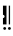
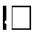
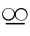
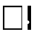
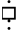
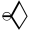
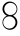
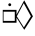
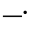
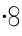
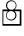
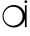
