# Lunar Alphabet (L. Katz)

> Source: [https://www.dcode.fr/lunar-alphabet-leandro-katz](https://www.dcode.fr/lunar-alphabet-leandro-katz)
> Retrieved: 2026-08-08
> Attribution: dCode.fr (CC BY notice on the source page).
> Reference-only extract: no converter, solver, API, or implementation code.

## What is the Lunar Alphabet?

The lunar alphabet was created by artist and poet Leandro Katz in 1978. Exhibited in several museums around the world, he used this alphabet to converse with director Jesse Lerner.

Leandro Katz created 2 almost identical versions of the alphabet, the second, in 1980, having higher resolution photos. He also proposed a typewriter, replacing the alphabetical keys with pictures of the phases of the moon.

## How to encrypt using Lunar Alphabet cipher?

The lunar alphabet is an alphabetical substitution by symbols of the phases of the moon. Leandro Katz being Argentinian, he uses the Spanish alphabet of 27 characters ( addition of Ñ ).

A B C D E F G H I J K L M N ~ O P Q R S T U V W X Y Z dCode.fr

A B C D E F G H I J K L M N ~ O P Q R S T U V W X Y Z dCode.fr

Example: DCODE is written

For encoding reasons, the letter Ñ cannot be encoded on dCode, it is automatically transformed into N .

## How to decrypt Lunar Alphabet cipher?

Katz's lunar alphabet decryption involves replacing each photograph of the moon with the corresponding letter of the Spanish alphabet.

Example: is read LEANDRO

## How to recognize a Lunar Alphabet ciphertext?

The message is made up of images representing the moon, from the smallest crescent, to the full moon, passing through each of the quarters, both in the ascending and descending moon.

All other references to the Earth's natural satellite are clues.

## Reference Images

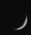
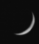
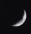
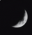
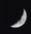
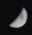
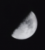
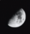
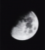
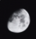
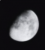
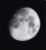
