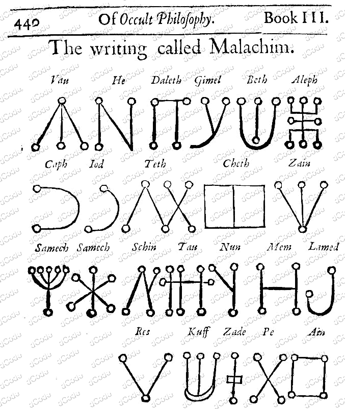

# Malachim Alphabet

> Source: [https://www.dcode.fr/malachim-alphabet](https://www.dcode.fr/malachim-alphabet)
> Retrieved: 2026-08-08
> Attribution: dCode.fr (CC BY notice on the source page).
> Reference-only extract: no converter, solver, API, or implementation code.

## What is the Malachim alphabet? (Definition)

In his book Of Occult Philosophy , Henri-Corneille Agrippa de Nettesheim describes an alphabet (a script) called Malachim , a name derived from a Hebrew word, meaning angel .

The Malachim writing/script is presented on page 440 of Book III, dated from the 16th century and here is a scan:

## How to encrypt using Malachim alphabet/cipher?

Malachim writing is a transcription of Hebrew characters into a Malachim symbol.

NB: There are 23 symbols for 22 letters of the Hebrew alphabet, the character Samech has 2 glyphs.

To encode from the usual Latin alphabet, a transliteration is necessary.

Example: The letter A can be transcribed as the Hebrew letter Aleph ( א ), the letter B as Beth ( ב ), etc. However, this transcription is not always feasible (there are only 22 Hebrew letters for 26 letters in the Latin alphabet).

Example: MALACHIN is transcribed מאלאגחינ or

Reminder: the Hebrew scriptures are read from right to left .

## How to decrypt Malachim alphabet/cipher?

The decryption of the Malachim alphabet is a substitution of the Malachim symbols by their Hebrew letter equivalent. To read in the Latin alphabet, a transliteration is required, however, not all Hebrew characters have a Latin alphabet match (such as ט or צ ), and some Hebrew letters have multiple equivalents in the alphabet (like ג for C or G , ו for F , V or U , or even י for I or J ).

Example: becomes אגריפפא or AGRIPPA

Reminder: the Hebrew scriptures are read from right to left .

## How to recognize a Malachim ciphertext? (Identification)

Malachim symbols are mainly made up of several straight (but sometimes curved) lines accompanied by circles (or large circular dots) at their ends.

For some, the symbols look like constellations.

All references to occult or esoteric sciences, magic, angels, or to Henri-Corneille Agrippa are clues.

The Celestial alphabets or the Passing of the River alphabet are very similar.

## When was Malachim invented?

Malachim was published in the 16th century, it could be an invention of the author of the book Heinrich Cornelius Agrippa.

## Reference Images

