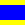
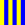
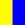

# Navy Signals Code

> Source: [https://www.dcode.fr/maritime-signals-code](https://www.dcode.fr/maritime-signals-code)
> Retrieved: 2026-08-08
> Attribution: dCode.fr (CC BY notice on the source page).
> Reference-only extract: no converter, solver, API, or implementation code.

## What is the Nautical Signals Flags alphabet? (Definition)

The International Code of Signals is a standardized system of visual communication used in maritime navigation to transmit messages between ships or between a ship and the shore. It relies primarily on nautical flags , also known as signal flags .

The system allows communication even in the event of radio failure, language barriers, or poor electronic reception.

## How to encrypt using Navy Signals cipher?

The International Code of Signals can be used as a substitution cipher: each flag represents a letter of the alphabet or a number from 0 to 9.

A B C D E F G H I J K L M N O P Q R S T U V W X Y Z dCode.fr

A B C D E F G H I J K L M N O P Q R S T U V W X Y Z dCode.fr

Example: ' FLAG ' is coded

The digits have a different shaped flag :

0 1 2 3 4 5 6 7 8 9

0 1 2 3 4 5 6 7 8 9

Each ship/boat only carries one set of flags , so if a letter is repeated, it cannot be coded. To deal with this eventuality, there are 4 substitution/repetition flags .

repeat the first flag

repeat the second flag

repeat the third flag

repeats the fourth flag (not used in the official version of the International code)

Example: SOS is translated

## How to decrypt Maritime Signals cipher?

Decoding Maritime Signals involves associating each flag with its corresponding letter or number.

Example: is translated NAVY .

Repeater flags are an exception: they replace a repetition of a previous flag in the same group.

Some groups of flags also have a predefined, complete meaning (an instruction, an emergency, or weather information)

## How to recognize Maritime Flag ciphertext?

The ciphered message is made of flags (squared) in basic colors: blue, white, yellow, red, black (no green and no compound colors) offering a large contrast.

Flags used in the navy, do not necessarily mean a distress signal, they can handle a radio problem and help ship navigation.

All references to the navy, naval forces (Royal Navy, US Navy etc.) and boats, lighthouses or distress situation (use of flare, buoy, whistle) in general are clues.

## What are the variants of the Maritime alphabet?

The main system used today is the International Code of Signals, adopted worldwide for civil and military navigation.

NATO uses 10 other flags (square format) to encode digits.

0 1 2 3 4 5 6 7 8 9 dCode.fr

0 1 2 3 4 5 6 7 8 9 dCode.fr

## Why using Maritime Signals Flags?

The Maritime Signal Code allows ships to communicate quickly and in a standardized way, even when radio communications are impossible or disrupted.

Because the flags are visual and internationally standardized, the system remains understandable regardless of the crew's language.

## What is the reference book for Maritime Signals?

The French reference codebook is available here

This code contains the rules and detailed descriptions of maritime communication signals, flags and procedures used throughout the world.

## Reference Images

