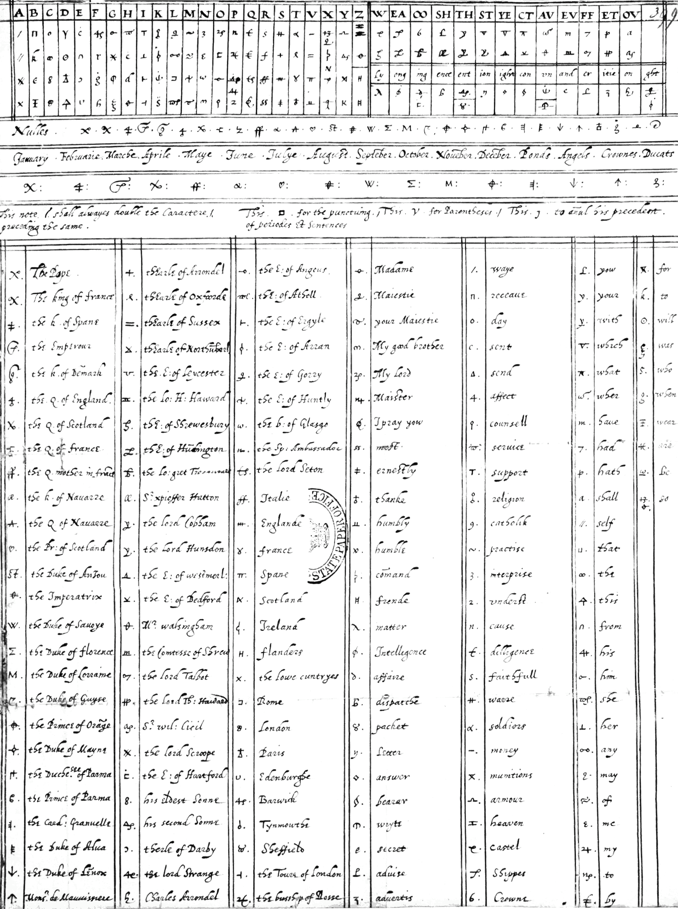
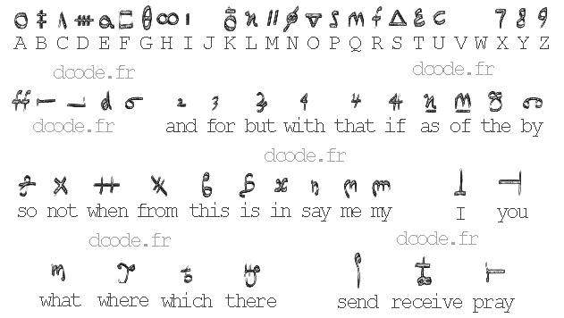

# Mary Stuart Code

> Source: [https://www.dcode.fr/mary-stuart-code](https://www.dcode.fr/mary-stuart-code)
> Retrieved: 2026-08-08
> Attribution: dCode.fr (CC BY notice on the source page).
> Reference-only extract: no converter, solver, API, or implementation code.

## What is the Mary Stuart Code? (Definition)

Mary Stuart (1542-1587), Queen of Scots, spent nearly twenty years captive in England. During her captivity, she continued to correspond with her allies. To protect her secrets from the spies of Elizabeth I, she used entirely encrypted letters. The entire collection of coded/encrypted correspondence constitutes a corpus of several dozen letters, some of which have historical value.

## How to encrypt using Mary Stuart cipher?

The cipher developed by Mary Stuart primarily used homophonic ciphers . This meant that multiple symbols could represent the same letter. Throughout the correspondence, there are 219 distinct symbols, as well as a system of diacritics (dots, dashes) to distinguish variants of a symbol. Some symbols represented entire words, proper nouns, or frequently occurring syllables , or even instructions to delete or repeat a letter.

The complete alphabet (also called the nomenclator ) was regularly changed but kept secret between her and her correspondents.

Example: an alphabet found visible at the UK National Archives

The most famous alphabet is the one used in the Babington Plot, led by Sir Anthony Babington, which aimed to kill Queen Elizabeth I so that Mary Stuart could take the throne. This is the alphabet proposed on this page:

Example: MARY is encoded as

The alphabet contains 5 blank characters that can be used as decoys or word separators (which complicates frequency analysis ).

## How to decrypt Mary Stuart cipher?

Deciphering the Mary Stuart cipher involves matching the symbols used to the letters (or words) in plaintext according to a correspondence table agreed upon between the sender and recipient of the message.

Example: Using the Babington plot alphabet, translates to QUEEN

## Who was Mary Queen of Scots?

Mary Stuart (or Mary I of Scotland) was born December 8, 1542 (and died February 8, 1587) was the Queen of Scotland from 1542 to 1567 and Queen consort of France between 1559 and 1560.

She was convicted of conspiring to assassinate the Queen of England during the Babington plot.

A book is dedicated to her and her code here (affiliate link)

## How were the letters decoded?

While some correspondence was decoded using discovered or intercepted nomenclators, several dozen letters remained illegible for nearly 500 years.

In 2023, three researchers transcribed the symbols using computer tools and then applied cryptological analysis. They identified plausible sequences in French and gradually reconstructed the correspondences. Plaintext copies found in English archives confirmed the correspondences.

The corpus used covers missives from the period 1578–1584, representing approximately 50,000 words. In it, Mary discusses her captivity, her diplomatic strategies, her support for the marriage between the Duke of Anjou and Elizabeth I, her complaints against the Earl of Leicester, and her hopes for an alliance with Spain. They also reveal her efforts to maintain a secret network of communications.

More information in the scientific article here

## Reference Images

