# Matoran Language

> Source: [https://www.dcode.fr/matoran-language](https://www.dcode.fr/matoran-language)
> Retrieved: 2026-08-08
> Attribution: dCode.fr (CC BY notice on the source page).
> Reference-only extract: no converter, solver, API, or implementation code.

## What is the Matoran language? (Definition)

Matoran is the most used language in the Matoran Universe from Lego Bionicle. It is used by the Great Beings including Mata Nui.

## How to write in Matoran?

The Matoran language has its own vocabulary, so there are theoretically thousands of words but only a few dozen are visible in the Bionicles films, however, an alphabet allows a correspondence between the letters of the English alphabet and the Matoran : A B C D E F G H I J K L M N O P Q R S T U V W X Y Z dCode.fr

A B C D E F G H I J K L M N O P Q R S T U V W X Y Z dCode.fr

Example: LEGO is translated

There is also a variant with hexagon shaped outlines, the interior is identical except for the K :

## How to translate/decrypt Matoran?

The Matoran can be deciphered by substituting the Matoran symbols with the associated letter of the alphabet.

Sometimes an additional translation may be necessary if the word is not in English.

Example: is transcribed MATA and this word means Spirit in Matoran

## How to recognize the Matoran alphabet? (Identification)

The symbols of the Matoran alphabet are circles with, inside, 1 to 2 small circles and/or 1 to 3 lines.

The same alphabet exists with an outer hexagon instead of the circle.

All references to the Lego Bionicle universe such as its character Mata Nui (great-spirit/being) are clues.

## Reference Images

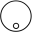
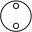
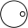
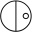
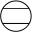
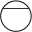
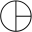
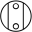
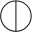
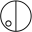
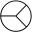
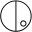
