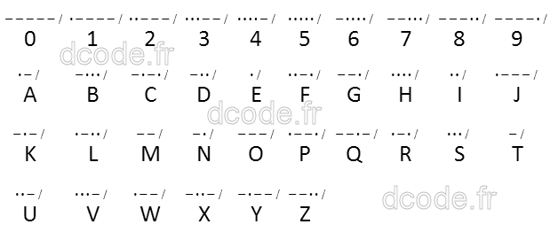
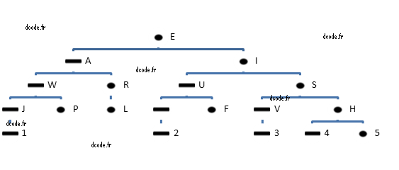
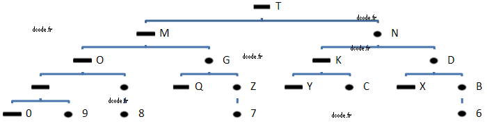
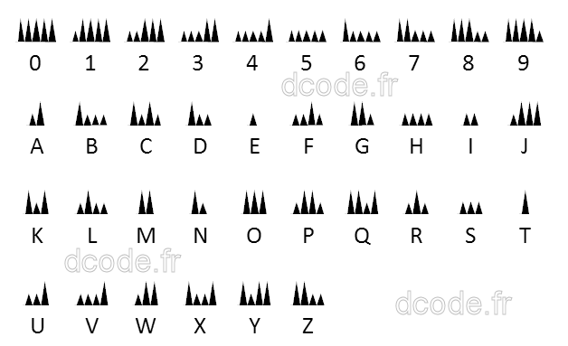

# Morse Code

> Source: [https://www.dcode.fr/morse-code](https://www.dcode.fr/morse-code)
> Retrieved: 2026-08-08
> Attribution: dCode.fr (CC BY notice on the source page).
> Reference-only extract: no converter, solver, API, or implementation code.

## What is Morse Code? (Definition)

Morse code is a communication system using short and long pulses (sound, light, electrical signals, etc.) to represent the letters of the alphabet. Adopted worldwide, it played a key precursor role in the history of telecommunications (notably via the telegraph). Although largely supplanted by digital technologies, it retains historical importance in some specific areas, such as military, maritime and radio transmissions, as well as for the famous SOS distress signal.

## How to encrypt using Morse Code cipher?

Morse code assigns to each letter, digit, or punctuation sign, a unique combination of signals made of short and long impulsions (usually represented with a dot . and a dash - ).

The alphabet or complete table of Morse Code is

Example: DCODE is coded in Morse language -.. -.-. --- -.. .

Long and short pulses can be electrical, sound (tap, beep), light (flashes/pulses) signals, or any other telecommunication format, anything is possible.

By convention, when writing, each character code is separated by a space and each word is separated by a slash / . Sometimes the characters are separated by a / and the words by a double slash // .

## How to decrypt Morse Code cipher?

Morse signal decryption/translation in English uses the same alphabet as encryption.

In order to accelerate the translation process, decoders use a tree like this:

## How to recognize Morse Code ciphertext?

The ciphered message is mainly composed of dots and dashes (or any other couple of characters, or even a triplet of 3 elements if the spaces are coded).

Morse code is usually auditory, a noise/sound made up of long and short tones (like beeps/clicks).

Example: bip biiiip bip = .-.

There is also a luminous variant, the presence of a clignotant light for 2 distinct durations.

Same with syllables in I or E for short and A or O for long.

Example: TATITA = -.- (long, short, long)

Messages sometimes starts with △ -.-.- (start of transmission) and end with ▽ .-.-. (end of transmission) (NB: The code .-.-. is also the code for the character + .)

## How to write Morse Code?

There is no standard way to write Morse code since it is primarily an audio signal.

Ideally, the written Morse code should be arranged on the same line. Computers, however, has trouble writing it with the dashes - or _ and the dots . which are not at the same level.

The key is to differentiate the characters: example ▄ (short) and ▄▄▄▄ (long).

## How to decipher audio MP3 Morse?

Listen to the message and type simultaneously on a keyboard . (dot) for a short/acute sound and - (dash) for a long/grave one.

If the message is too fast or the sound is noisy, use the spectral analysis tool.

## How to decipher Morse without spaces?

Deciphering Morse without a separator is very difficult, a separator is almost essential as the possibilities are exponential.

Example: -.-. (4 characters) can mean 8 different things: C or KE or NN or NTE or TR or TAE or TEN or TETE

Each Morse code character (dash or dot) multiplies the number of possibilities by 2.

Example: 4 characters is therefore 2^4 = 8 possible translations, for 20 characters it is more than 1 million possibilities.

To help decryption dCode offers tools, including a brute-force or dictionary attack. Most methods will favor common letters in French (like E) and filter the results to retain only the most probable ones.

## What are the variants of the Morse Cipher?

It is possible to replace the two characters for short and long by others like A and B for example.

A variant of Morse code can reverse the dashes and dots to fool the decoder.

There is a fairly well known overencryption: Fractionated Morse cipher.

## What is the mountain Morse code?

A variant encodes morse with a kind of mountain profile:

## How has the Morse alphabet been created?

There are no real rules, however, frequent characters ( E , T , A for example) are coded with short signals (1 or 2 impulsions). The less frequent letters are coded with 4 signals maximum, digits with 5.

## How to learn the Morse alphabet with mnemonics?

Many methods are used, the principle is to remember 26 words, and with these words find the corresponding association between a letter and its code.

Here is a list of words where each vowel is a dot, each consonant is a dash.

Example: V is described by oooh , that has three vowels and one consonant , so V is coded in Morse with ...-

A ax B beau C cola D duo E e F uomo G gnu H oooa I io J iggs K kim L olei M vn N no O pls P ople Q drug R ice S ooo T t U ear V oooh W arc X heat Y hanz Z blue

A ax B beau C cola D duo E e F uomo G gnu H oooa I io J iggs K kim L olei M vn N no O pls P ople Q drug R ice S ooo T t U ear V oooh W arc X heat Y hanz Z blue

Another method used English pronunciation, stressed syllables standing for a dash and unstressed syllabes stands for a dot .

Example: PSYCHOLOGY , begins with a P , and contains 2 syllables in O , P is then coded in Morse .--.

A aGAIN, aPART B BE a good boy C COca-Cola, CHARlie-CHARlie D DRAcula E eh! F for the FAIRest G GOOGOLplex H holyday in I i bid J in JAWS JAWS JAWS K KANGaROO L liNOleum M MAMA N NAvy, NAzi O OH MY GOD, OREO P a PIZZA pie Q QUEENs WEDding DAY R roTAtion S sisisi T TALL U uniFORM V victory V W the WORLD WAR X X marks the SPOT Y WHY dit I DIE Z ZOO ZOO keeper . a STOP, a STOP, a STOP , COMMA, it s a COMMA ? it s a QUESTION, is it?

A aGAIN, aPART B BE a good boy C COca-Cola, CHARlie-CHARlie D DRAcula E eh! F for the FAIRest G GOOGOLplex H holyday in I i bid J in JAWS JAWS JAWS K KANGaROO L liNOleum M MAMA N NAvy, NAzi O OH MY GOD, OREO P a PIZZA pie Q QUEENs WEDding DAY R roTAtion S sisisi T TALL U uniFORM V victory V W the WORLD WAR X X marks the SPOT Y WHY dit I DIE Z ZOO ZOO keeper . a STOP, a STOP, a STOP , COMMA, it s a COMMA ? it s a QUESTION, is it?

To train yourself, morse code kits are available (for children and adults) to transmit Morse here (affiliate link)

## How to send a SOS in Morse?

SOS is coded ...---... (3 shorts, 3 longs, 3 shorts)

## How to mark the end of a character in Morse?

In practice, when a letter is finished, the morse encodes the end of a character with empty sounds (silence) or empty visuals a bit long.

When retranscribing, a slash / or any separating character can be added.

## Why Morse has this name?

Morse code was developed by Samuel Morse, an American scientist whose name he kept.

Morse therefore has no meaning or relation to the walrus animal ( morse in French).

## When Morse was invented?

Morse Code was invented in 1835 by Samuel Morse

## Reference Images

