# Mourier Alphabet

> Source: [https://www.dcode.fr/mourier-alphabet](https://www.dcode.fr/mourier-alphabet)
> Retrieved: 2026-08-08
> Attribution: dCode.fr (CC BY notice on the source page).
> Reference-only extract: no converter, solver, API, or implementation code.

## What is the Mourier alphabet? (Definition)

The Mourier alphabet is a geometric alphabet defined by the danish designer Eric Mourier in 1971. It associates the latin letters with a symbol created from a 7x7 square (49 squares) composed only of lines which do not intersect and separated by a space of the same size.

## How to encrypt using Mourier alphabet?

In the original version of 1971 Mourier proposed a substitution of the letters A-Z by a Mourier square symbol according to the correspondence table: A B C D E F G H I J K L M N O P Q R S T U V W X Y Z dCode.fr

A B C D E F G H I J K L M N O P Q R S T U V W X Y Z dCode.fr

Example: MOURIER is written as

The alphabet was then digitized in typeface in 2002 by Sébastien Hayez, and was enriched with ASCII characters.

A 2.0 version has been available since 2020 to adapt to Cyrillic characters.

dCode is intentionally limited to version 1.0 with uppercase letters A-Z , lowercase a-z , numbers 0-9 and the characters # , $ , & , * and / .

## How to decrypt Mourier alphabet?

The Mourier alphabet is a mono-alphabetic substitution (1 Mourier symbol = 1 plain letter or number character) so a replacement of the symbols makes it possible to find the plain message.

Example: is translated DCODE

## How to recognize a Mourier ciphertext? (Identification)

The Mourier alphabet is resolutely geometric with a fixed size of 7x7 small squares.

The assembly of characters can make one think of a labyrinth.

Any use of the alphabet or the font must cite the source and the license: Mourier, SIL Open Font License, v1.1 , available in the Velvetyne directory here

## Reference Images

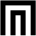

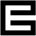
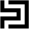
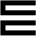
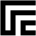
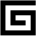
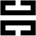
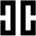
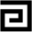
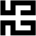
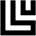
