# Navajo Code

> Source: [https://www.dcode.fr/navajo-code](https://www.dcode.fr/navajo-code)
> Retrieved: 2026-08-08
> Attribution: dCode.fr (CC BY notice on the source page).
> Reference-only extract: no converter, solver, API, or implementation code.

## What is the Navajo Code? (Definition)

The Navajo Code is a military coding system used during World War II by the United States Marines. It involved the use of the Navajo language, a complex and little-known Native American language.

## How to encrypt using Navajo cipher?

The Navajo code consists of an alphabet (A to Z) and a dictionary which contains words from English military vocabulary. The code associates a word in the Navajo dialect with each of these elements. In doing so, the Najavo code is a word or character substitution encryption.

The military documents having been declassified, here is the alphabet (version 2) used (next to the translation of the word):

Some letters have multiple Navajo code translations, dCode selects one at random.

To this alphabet is added a dictionary containing several hundred words from Navajo vocabulary.

Example: FRANCE translates directly to DA-GHA-HI but FRANCE can also be transcribed into the letters F,R,A,N,C,E : MA-E, GAH, WOL-LA-CHEE , NESH-CHEE, MOASI, DZEH

Do not confuse the Navajo language (used by the eponymous people) and the Navajo code (used by the American military, described on this page)

## How to decrypt Navajo cipher?

Decryption consists in identifying words of in Navajo language and translate then. In practice, dCode search if vocabulary words are included in the message, then tries letters. Punctuation words are also translated.

Example: NA-NIL-IN means confidential

Example: US-DZOH means dash (in English) and is converted to - (punctuation)

The Navajo language uses hyphens, if the message does not contain any, dCode will try to correctly find them in Navajo (with a hyphen), but the outcome is not perfect.

Example: LHA-CHA-EH BA-GOSHI NE-AHS-JAH CHINDI AH-NAH is translated by DCODE

## How to recognize Navajo ciphertext?

The ciphered message is composed of characteristic sounds such as TSA , DAH , DZEH .

Any reference to the Native American Navajo tribe is a clue.

The film Windtalkers (2002) pays homage to Navajo code talkers.

## Why was the Navajo language chosen?

The Navajo code was originally an Indian tribe language only spoken. Unlike any other language, the verb does not relay on the subject but also with the genitive. This dialect is extremely complex. In 1942, only 28 Americans understand it and speak it. It will be used by the Americans during the war against the Japanese. This is one of the few codes of history that will never be cracked.

## Where to find the Navajo Code Dictionary?

The Navajo code remained a confidential document for a long time, but it has since been declassified by the United States and among the documents is the alphabet, the dictionary (version 1), and a learning guide. Here are the pages used by dCode:

The alphabet and the dictionary were then updated (version 2) and here is the supplement version:

These documents come from Navajo dictionary and training materials of code talkers, 1945 in the digital library Colorado Plateau Archives here

An even more complete version (3) is proposed here

## When Navajo code has been invented?

The language is very old, but the code has been set during World War II.

## Reference Images

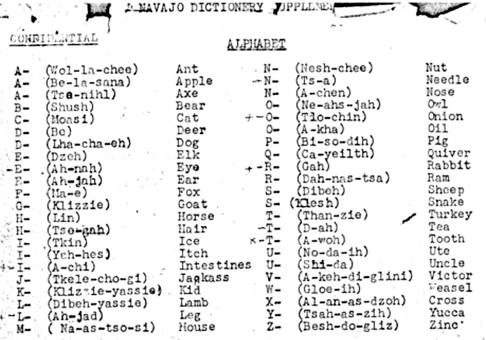
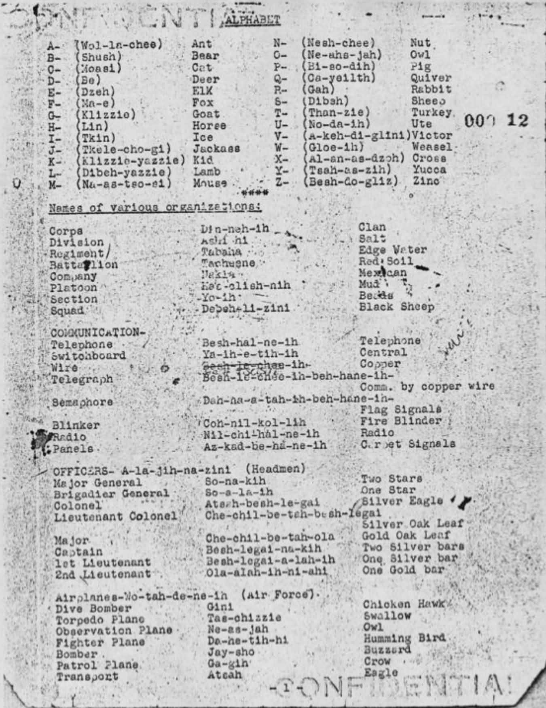
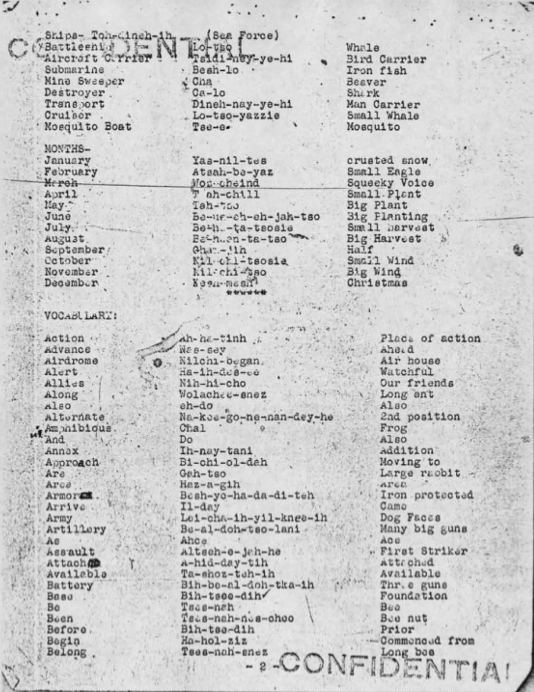
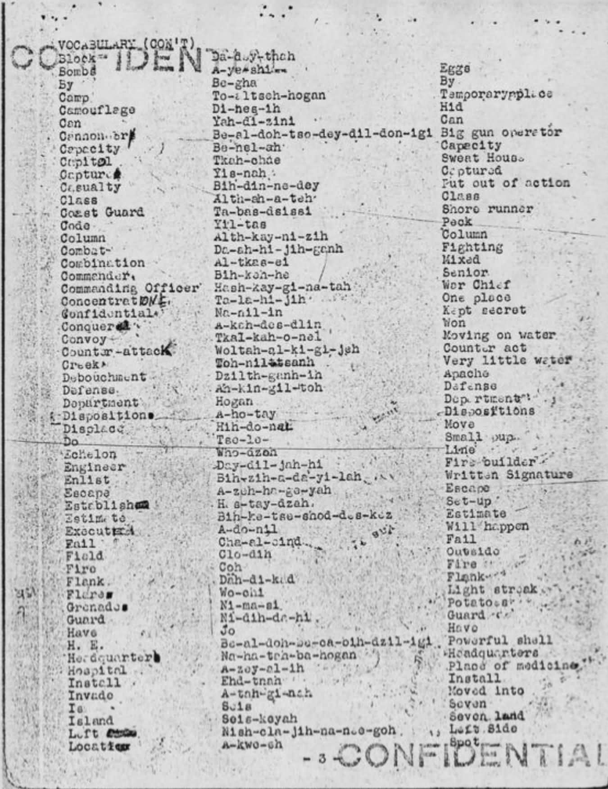
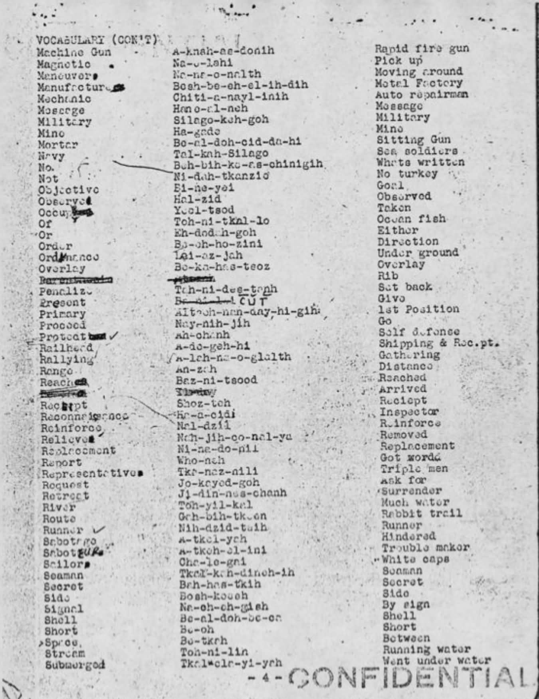
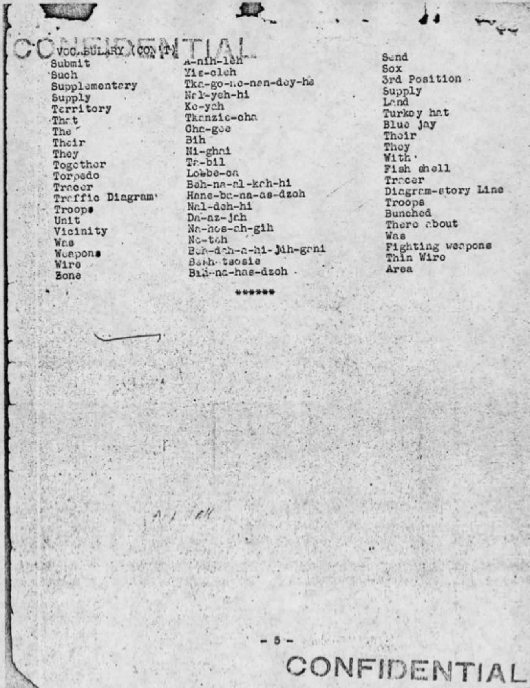
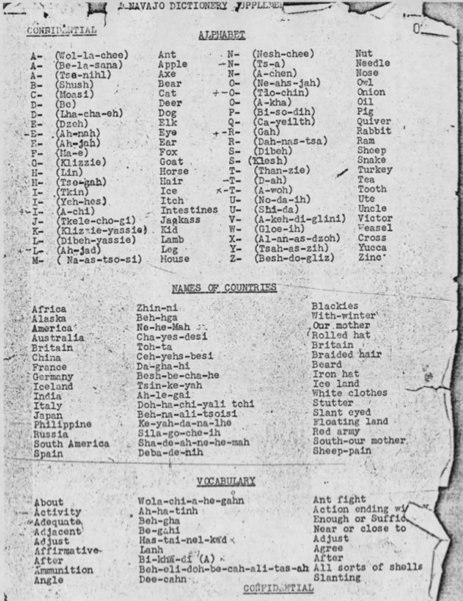
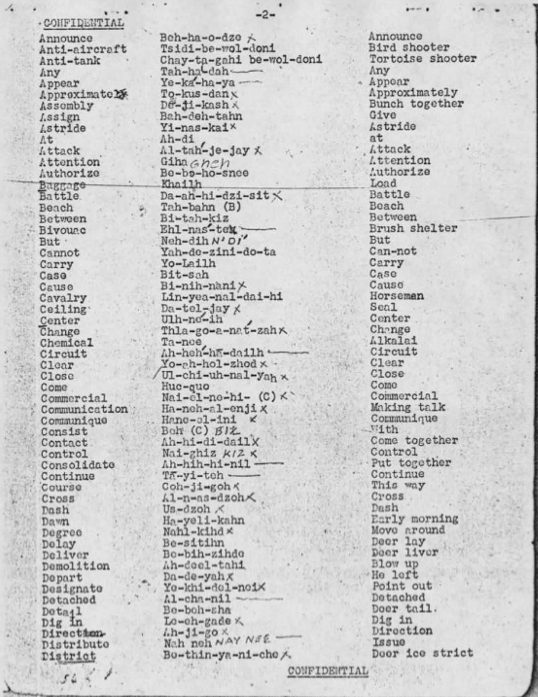
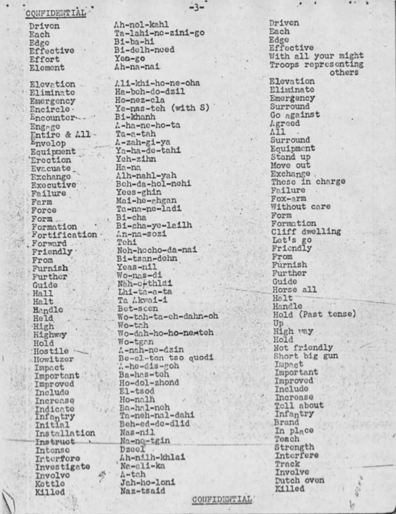
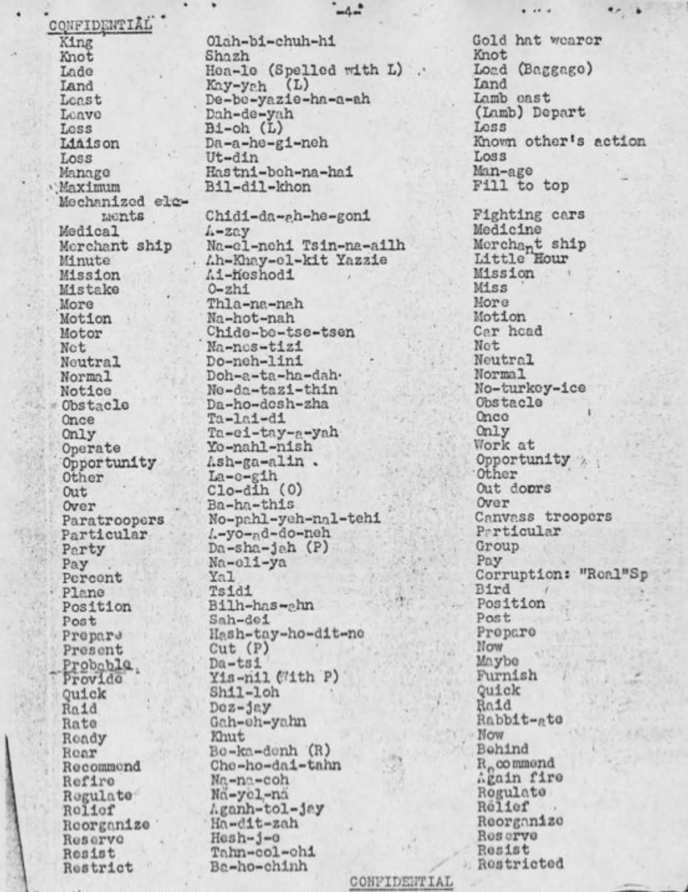
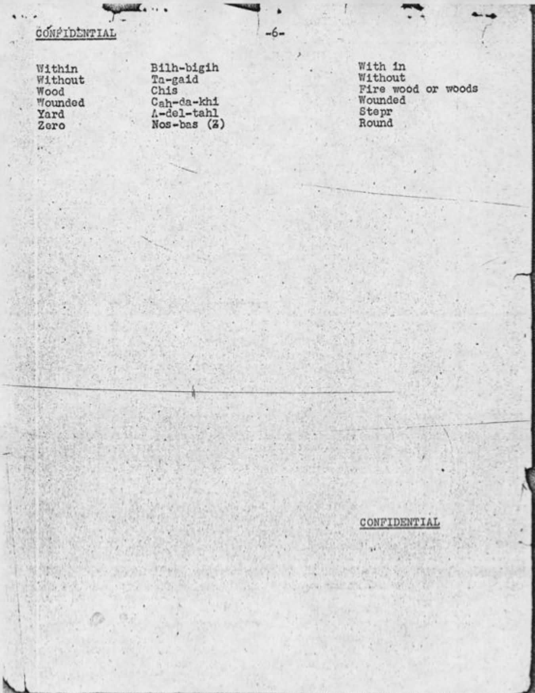
