# Nazcaän Alphabet

> Source: [https://www.dcode.fr/nazcaan-alphabet](https://www.dcode.fr/nazcaan-alphabet)
> Retrieved: 2026-08-08
> Attribution: dCode.fr (CC BY notice on the source page).
> Reference-only extract: no converter, solver, API, or implementation code.

## What is the Nazcaan script? (Definition)

Nazcaan script is a fictional language created for the video game Ni no Kuni.

## How to write in Nazcaan script?

The Nazcaä script is a substitution of the letters of the Latin/French alphabet by Nazcaan symbols.

According to the game manual, the writing is done from right to left . The texts do not include spaces, punctuation or distinguish between upper and lower case .

The game having been published in Japan, it had several different localizations and therefore several different alphabets.

Alphabet (1): used in the English version. The letters I and J are identical, just like U and V and W is represented with 2 times V . In addition , 3 characters represent pairs of letters: TH , CH and EI .

Alphabet (2): used in the French version. The 26 letters of the alphabet are present.

Example: NINOKUNI translates to

## How to translate Nazcaan?

The Nazcaä script is deciphered by substituting the Nazcaan symbols by their equivalent letter(s) in the selected alphabet.

Example: translates to GHIBLI

## How to recognize a Nazcaan ciphertext? (Identification)

The characters of the Nazcaä alphabet are quite curved, sometimes have strokes and loops. The figures have a circular base.

Any references to the Ni no Kuni 二ノ国 video game or to Level 5 and Ghibli studios are clues.

## Reference Images

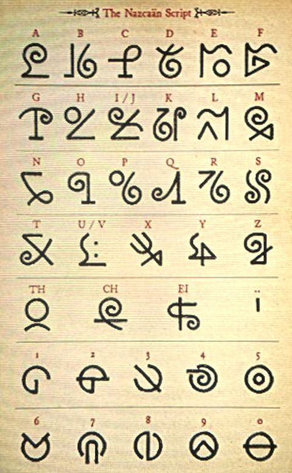
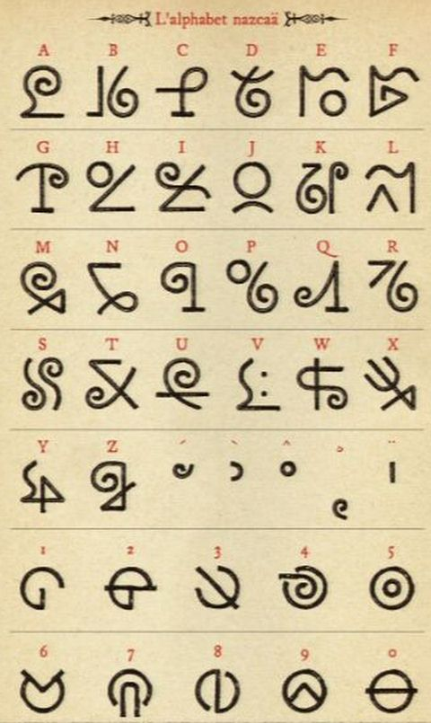
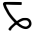
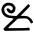
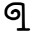
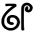
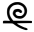
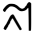
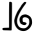
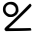
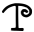
