# New Alphabet by Crouwel

> Source: [https://www.dcode.fr/new-alphabet-crouwel](https://www.dcode.fr/new-alphabet-crouwel)
> Retrieved: 2026-08-08
> Attribution: dCode.fr (CC BY notice on the source page).
> Reference-only extract: no converter, solver, API, or implementation code.

## What is Crouwel's New Alphabet? (Definition)

New Alphabet is an alternative alphabet created to adapt to the technical limitations of CRT screens that had difficulty representing curved or diagonal shapes. The letters and numbers are therefore composed only of straight, vertical and horizontal lines.

## How to encode using New Alphabet?

This is not strictly speaking an encoding but a change in the writing of the alphabet. The new characters replacing A-Z are: A B C D E F G H I J K L M N O P Q R S T U V W X Y Z dCode.fr

A B C D E F G H I J K L M N O P Q R S T U V W X Y Z dCode.fr

The numbers also have their replacements: : 0 1 2 3 4 5 6 7 8 9 dCode.fr

0 1 2 3 4 5 6 7 8 9 dCode.fr

Example: ALPHABET is written

## How to decode the New Alphabet?

Here again, this is not strictly speaking a decoding but an adapted reading, replacing the alphanumeric characters with those of the new alphabet.

Example: is translated 1967

## How to recognize a New Alphabet ciphertext? (Identification)

A message written in New Alphabet contains only straight vertical or horizontal lines and right angles. The characters are all composed of a single piece except exceptionally, a point or a horizontal bar can be displayed in addition above or above the character.

Some letters have commonalities or very strong resemblances with their counterparts in the original Latin alphabet commonly represented on 7-segment displays .

New Alphabet was among 23 digital typefaces/fonts acquired by the Museum of Modern Art (MoMA) in January 2011 for its Architecture and Design Collection and showcased in exhibition Standard Deviations .

## When was New Alphabet invented?

New Alphabet was designed by Dutch graphic designer Wim Crouwel in 1967

## Reference Images

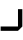
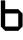
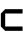
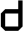
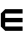
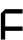
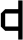
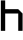
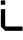
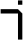
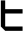

