# Ninjargon Alphabet (Lego Ninjago)

> Source: [https://www.dcode.fr/ninjargon-alphabet](https://www.dcode.fr/ninjargon-alphabet)
> Retrieved: 2026-08-08
> Attribution: dCode.fr (CC BY notice on the source page).
> Reference-only extract: no converter, solver, API, or implementation code.

## What is Ninjargon? (Definition)

Ninjargon is the fictional script used in the LEGO Ninjago universe. Visually inspired by East Asian alphabets, it is not a spoken language, but an alphabet (or coded writing system).

## How to encode with Ninjargon?

Ninjargon operates as a simple substitution system: each symbol corresponds to a letter of the Latin alphabet. The inscriptions visible on posters, cards, and scenery use Ninjargon glyphs that transcribe English or other languages ​​written in the Latin alphabet. Here is a table of correspondence between Latin letters and Ninjargon glyphs: A B C D E F G H I J K L M N O P Q R S T U V W X Y Z dCode.fr

A B C D E F G H I J K L M N O P Q R S T U V W X Y Z dCode.fr

Example: NINJAGO translates to

Arabic numerals are also coded: 0 1 2 3 4 5 6 7 8 9 dCode.fr

0 1 2 3 4 5 6 7 8 9 dCode.fr

## How to decode Ninjargon?

Substitute each Ninjago glyph with the corresponding letter or number using the conversion table.

Example: translates LEGO

## How to recognize the Ninjargon? (Identification)

The visual appearance of the glyphs is angular and stylized, reminiscent of a blend of runes and Asian calligraphic strokes (kanji).

Approximately half of the symbols are symmetrical (vertically, horizontally, or diagonally).

The Ninjargon can be found on posters, signs, maps, screens, and stickers from the LEGO Ninjago universe.

The presence of ninjas or dragons is a clue.

## Reference Images

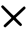
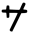
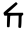
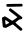
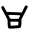
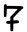
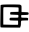
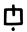
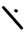
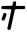
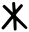
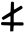
