# Ogham Alphabet

> Source: [https://www.dcode.fr/ogham-alphabet](https://www.dcode.fr/ogham-alphabet)
> Retrieved: 2026-08-08
> Attribution: dCode.fr (CC BY notice on the source page).
> Reference-only extract: no converter, solver, API, or implementation code.

## What is the oghamic writing? (Definition)

Ogham (or Ogam ) is an ancient alphabet used primarily to write Old Irish and Pictish.

Ogham is mostly represented in the form of marks (letters) composed of strokes oriented relative to a central line, all usually engraved on vertical stones.

The Ogham alphabet is composed of 20 letters, some of which correspond to letters in the classical Latin alphabet.

There are sometimes other rare symbols that appear in manuscripts that are combinations of letters.

## How to write in Ogham?

It is possible to write English with Ogham letters by substituting the letters with Ogham symbols (but not all letters necessarily have an equivalent).

Here is the list of symbols and the equivalent(s) by transcription in the English alphabet:

ᚁ B ᚎ Z ᚂ L ᚏ R ᚃ F/V ᚐ A ᚄ S ᚑ O ᚅ N ᚒ U ᚆ H ᚓ E ᚇ D ᚔ I ᚈ T ᚕ EA ᚉ K ᚖ OI ᚊ Q ᚗ UI ᚋ M ᚘ P/IO ᚌ G ᚙ CH/X/AE ᚍ GN/Y ᚚ P

ᚁ B ᚎ Z ᚂ L ᚏ R ᚃ F/V ᚐ A ᚄ S ᚑ O ᚅ N ᚒ U ᚆ H ᚓ E ᚇ D ᚔ I ᚈ T ᚕ EA ᚉ K ᚖ OI ᚊ Q ᚗ UI ᚋ M ᚘ P/IO ᚌ G ᚙ CH/X/AE ᚍ GN/Y ᚚ P

The writing is generally vertical from bottom to top but recent adaptation has led to more horizontal writing from left to right.

NB: some Ogham scripts were sometimes written from top to bottom and not from bottom to top. Since the writing was on stones and Ogham is symmetrical, these could be oriented from bottom to top or from top to bottom.

Example: CELT is written horizontally or vertically:

The writing of figures and numbers is not documented and does not appear on the inscriptions on engraved stones found in Ireland/celtic countries.

## How to translate Ogham?

Ogham reading/translation requires the correspondence between the letters of the alphabet Ogham and our usual Latin alphabet.

Example: is decoded OGHAM

## How to recognize Ogham ciphertext?

The Ogham symbols generally follow a vertical or horizontal line.

The message is composed of bars/sticks, horizontal and vertical lines which are linear and often parallel marks.

Ogham appears to have served primarily for memorial inscriptions on tombstones, where it was used to mark the names of the deceased.

## What are the variants of the Ogham cipher?

Ogham writing can be vertical (usually top to bottom but sometimes bottom to top) or horizontal (left to right).

## What is the Ogham Alphabet (Unicode)?

The Ogham alphabet is included in the Unicode standard (U+1680 to U+169F), here are the characters: ᚁ ᚂ ᚃ ᚄ ᚅ ᚆ ᚇ ᚈ ᚉ ᚊ ᚋ ᚌ ᚍ ᚎ ᚏ ᚑ ᚒ ᚓ ᚔ ᚕ ᚖ ᚗ ᚘ ᚙ ᚚ ᚛ ᚜

ᚁ ᚂ ᚃ ᚄ ᚅ ᚆ ᚇ ᚈ ᚉ ᚊ ᚋ ᚌ ᚍ ᚎ ᚏ ᚑ ᚒ ᚓ ᚔ ᚕ ᚖ ᚗ ᚘ ᚙ ᚚ ᚛ ᚜

The symbol ᚛ represents the beginning and ᚜ the end of a sentence or text (but this is not mandatory).

In this standard, the symbols representing the vowels A, E, I, O, U are coded with small dots whereas in handwritten writing, short strokes (straight and not oblique) are used.

## When was Ogham writing invented?

Historians date the Ogham to around the 4th century.

## Reference Images

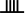
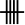
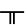
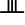
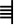
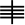
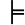
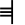
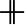
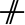
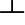
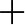
