# Ophidian Alphabet (Ultima)

> Source: [https://www.dcode.fr/ophidian-alphabet-ultima](https://www.dcode.fr/ophidian-alphabet-ultima)
> Retrieved: 2026-08-08
> Attribution: dCode.fr (CC BY notice on the source page).
> Reference-only extract: no converter, solver, API, or implementation code.

## What is the Ophidian Alphabet? (Definition)

The Ophidian Alphabet is a fictional writing system featured in Ultima VII Part Two: Serpent Isle. It is a monoalphabetic substitution cipher: each Ophidian glyph corresponds exactly to a Latin letter ( A-Z ) or a digit ( 0-9 ). It is used in the ruins of the Ophidian civilization for signs, books, and inscriptions.

## How to encode a text using the Ophidian Alphabet?

Encoding a text consists of applying a mapping table between Latin characters and Ophidian glyphs: A B C D E F G H I J K L M N O P Q R S T U V W X Y Z 0 1 2 3 4 5 6 7 8 9 dCode.fr

A B C D E F G H I J K L M N O P Q R S T U V W X Y Z 0 1 2 3 4 5 6 7 8 9 dCode.fr

Example: ULTIMA is written

The system does not distinguish between uppercase and lowercase letters. Special characters and punctuation are generally not represented.

## How to decode a text written in the Ophidian Alphabet?

To decode, identify each Ophidian glyph and replace it with its equivalent using the mapping table.

Example: translates to SERPENT

In Ultima 7, the Translation spell or a special lens on Monk Isle allows instant decoding of Ophidian texts.

## How to recognize a text written in the Ophidian Alphabet?

A text written in the Ophidian Alphabet can be recognized by its stylized glyphs resembling snakes or winding serpentine paths, with characteristic S-shaped curves.

Any reference to the role-playing game Ultima 7, especially Ultima VII Part Two: Serpent Isle, is a strong clue.

dCode uses the Ophidian font created by Neale Davidson here

## Reference Images

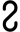
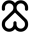
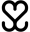
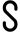
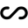
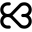
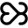
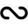
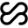
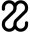
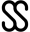
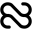
