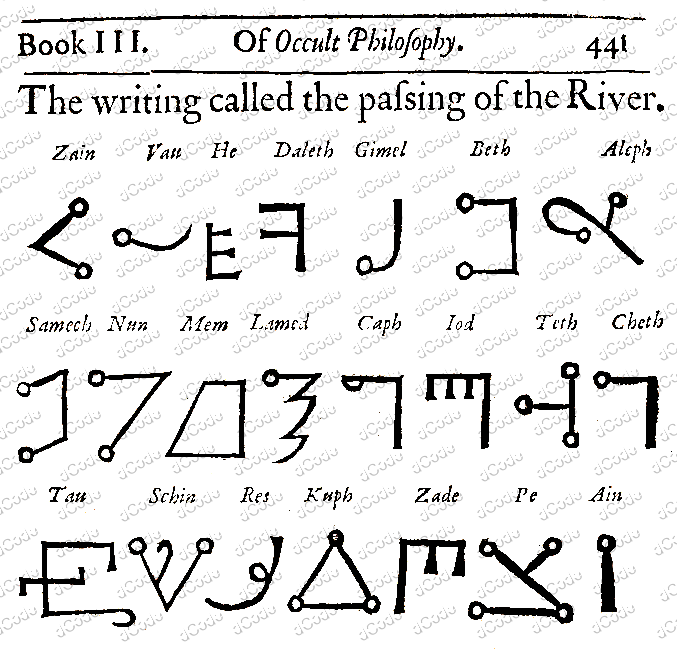

# Passing the River Alphabet

> Source: [https://www.dcode.fr/passing-river-alphabet](https://www.dcode.fr/passing-river-alphabet)
> Retrieved: 2026-08-08
> Attribution: dCode.fr (CC BY notice on the source page).
> Reference-only extract: no converter, solver, API, or implementation code.

## What is the Passing of the River alphabet? (Definition)

In the book Of Occult Philosophy , Heinrich-Cornelius Agrippa describes page 441 of Book III, an alphabet called Passing of the River (or Transitus Fluvii in Latin) composed of 22 symbols, here is a scan:

## How to encrypt using Passing of the River alphabet/cipher?

The writing with Transitus Fluvii consists of a substitution of the Hebrew characters by a symbol of the alphabet Passage du Fleuve.

To write a word in the Latin alphabet (with the letters from A to Z of our usual alphabet) a transliteration is required.

Example: The letter A can be transcribed with Aleph (Hebrew letter א ), just like the letter B with Beth ( ב ), etc. However, only 22 letters exist in Hebrew, and transcription to the 26 Latin letters is not always feasible.

Example: TRANSITUS is transcribed תראנשיתוש or

Hebrew script is read from right to left .

## How to decrypt Passing of the River alphabet/cipher?

The decryption of the Passing of the River alphabet consists of a substitution of the symbols by the corresponding letter of the Hebrew alphabet. A word or phrase in English requires translation or transliteration, but not all Hebrew characters have an equivalent in the alphabet (which is the case for the letters ט or צ ), while others letters have 2 or 3 possible transliterations (the letter ג can correspond to C or G , י to I or J or even ו to F , V or ' U').

Example: becomes אנגהליג or FLUVII

Hebrew script is read from right to left .

## How to recognize a Passing of the River ciphertext? (Identification)

The glyphs/symbols of the Passage du Fleuve alphabet are composed of straight lines (sticks), more rarely curved, often (but not always) ending in circles at the ends (large circular dots). This representation can make think of a constellation of stars.

All references to the crossing of the Euphrates by the Jews in the Bible , or to the angels, or to the occult sciences, or to Agrippa are clues.

The River Passage alphabet is very similar to the Malachi alphabet or the Celestial alphabet.

## When was Passing of the River invented?

Heinrich-Cornelius Agrippa's book dates from the early 16th century. The author of the alphabet is unknown.

## Reference Images

