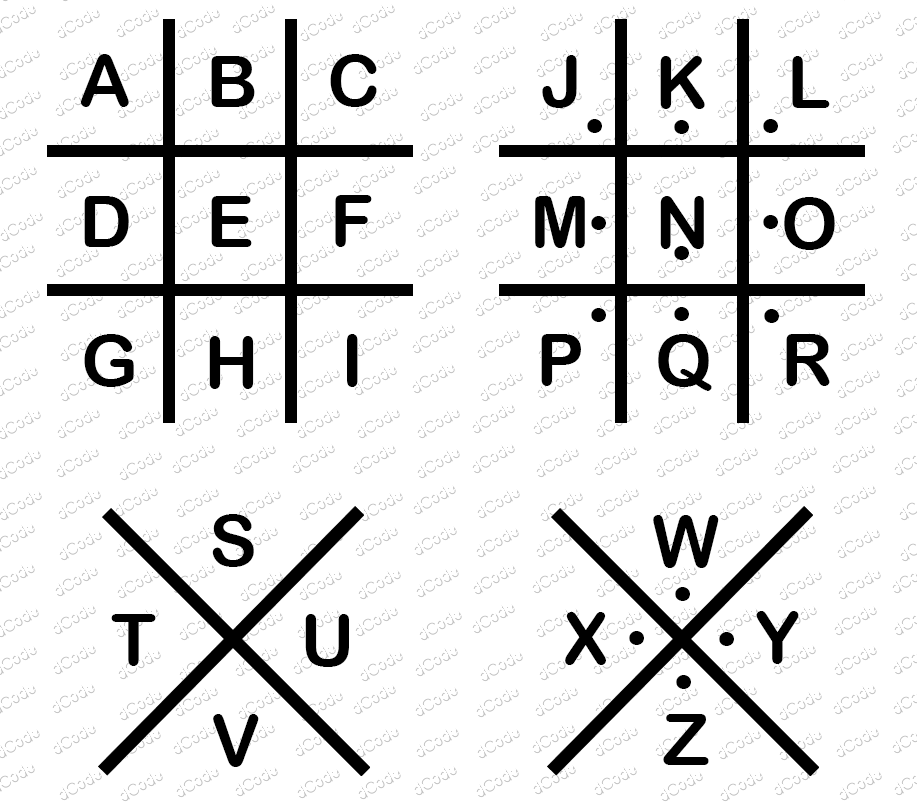

# Pigpen Cipher

> Source: [https://www.dcode.fr/pigpen-cipher](https://www.dcode.fr/pigpen-cipher)
> Retrieved: 2026-08-08
> Attribution: dCode.fr (CC BY notice on the source page).
> Reference-only extract: no converter, solver, API, or implementation code.

## What is the PigPen cipher? (Definition)

The Pig Pen Cipher , also known as the Freemason Cipher (or masonic alphabet), is an encryption system that was historically used by some members of Freemasonry to protect their communications.

It is based on a special arrangement of letters in a grid (cross or grid like tic tac toe ) in order to use 26 symbols to represent the letters of the alphabet by substitution.

## How to encrypt using PigPen cipher?

To encode a message with the Pig Pen number, each letter of the masonic alphabet is associated with a unique symbol.

The symbols are designed with a 3x3 grid/grid, crosses and dots as a basis.

The Pigpen correspondence/lookup table is therefore:

A B C D E F G H I J K L M N O P Q R S T U V W X Y Z dCode.fr

A B C D E F G H I J K L M N O P Q R S T U V W X Y Z dCode.fr

Numbers have no associated symbols.

Example: DCODE is encrypted

Multiple variants exist for the creation of the alphabet and each changes the association of symbols and letters (see below).

## How to decrypt using PigPen cipher?

PigPen decryption consists in replacing each PigPen symbol by the corresponding letter to reveal the original message.

Example: corresponds to letters NAPOLEON

## How to recognize PigPen ciphertext?

The ciphered message is made from symbols with right angles (corners) which sometime has a dot (50 of symbols have a dot).

The appearance of the glyphs is angular and the message can have a visual similarity to a maze with dots.

The message has a maximum of 26 distinct characters.

The presence of notions such as pigs, pens, gate or farm are clues.

The reference to Charles M. Schulz's comic book Peanuts reminds us that one of his characters is called Pigpen .

The generalization of the Freemasons to the Illuminati is a common drift.

The eye of providence (all seeing eye) is a symbol of the Freemasons.

## What are the variants of the Freemason's PigPen cipher?

It exists multiple variants for associating symbols and letters, here are those identified by dCode: #0 ABCDEFGHIJKLMNOPQRSTUVWXYZ (Original version, filling grids ⌗,⌗• then crosses ✕,✕•) #1 ABCDEFGHIJKLMNOPQRSTVUWXZY (Variant modifying cross filling by rotation ⟲) #2 ABCDEFGHINOPQRSTUVJKLMWXYZ (⌗ then ✕ then ⌗• then ✕•) #3 NOPQRSTUVWXYZABCDEFGHIJKLM (⌗•, ✕• ⌗, ✕) #4 IJKLMNOPQRSTUVWXYZABCDEFGH (✕, ✕•, ⌗, ⌗•) #5 ACEGIKMOQBDFHJLNPRSUWYTVXZ (Variant alternating ⌗ and ⌗• then ✕ and ✕• called Sandi Kotak in Indonesia) #6 ACEGIKMOQBDFHJLNPRSUYWTVZX (Variant of variant #5, filling crosses by rotation ✕⟲) #7 ABCDEFGHILMNOPRSTV-------- (Version Heinrich Cornelius Agrippa von Nettelsheim) #8 BDFHJLNPRACEGIKMOQT-V-S-U- (Version La Buse)

#0 ABCDEFGHIJKLMNOPQRSTUVWXYZ (Original version, filling grids ⌗,⌗• then crosses ✕,✕•) #1 ABCDEFGHIJKLMNOPQRSTVUWXZY (Variant modifying cross filling by rotation ⟲) #2 ABCDEFGHINOPQRSTUVJKLMWXYZ (⌗ then ✕ then ⌗• then ✕•) #3 NOPQRSTUVWXYZABCDEFGHIJKLM (⌗•, ✕• ⌗, ✕) #4 IJKLMNOPQRSTUVWXYZABCDEFGH (✕, ✕•, ⌗, ⌗•) #5 ACEGIKMOQBDFHJLNPRSUWYTVXZ (Variant alternating ⌗ and ⌗• then ✕ and ✕• called Sandi Kotak in Indonesia) #6 ACEGIKMOQBDFHJLNPRSUYWTVZX (Variant of variant #5, filling crosses by rotation ✕⟲) #7 ABCDEFGHILMNOPRSTV-------- (Version Heinrich Cornelius Agrippa von Nettelsheim) #8 BDFHJLNPRACEGIKMOQT-V-S-U- (Version La Buse)

The Knight Templars cipher , the rosicrucian cipher, tic tac toe cipher, or the Dada Urka cipher are very similar and have very close symbols.

Any other variant remains decipherable by mono-alphabetic substitution .

## Why was Pig Pen cipher created?

Used by the Freemasons, this encryption allowed a secret and relatively secure written correspondence.

## Why this cipher is named Pig Pen?

Symbols can be assimilated to pens and dots could be interpreted as small pigs.

## When PigPen was invented?

The Pig Pen Cipher is of ancient origin, but its exact date of invention is not known with certainty.

It has been widely used by Freemasons throughout their history, but its precise origins remain a subject of debate among historians.

## Reference Images

