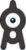
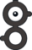
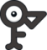
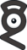
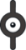
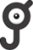
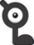

# Unown Pokemon Alphabet

> Source: [https://www.dcode.fr/pokemon-unown-alphabet](https://www.dcode.fr/pokemon-unown-alphabet)
> Retrieved: 2026-08-08
> Attribution: dCode.fr (CC BY notice on the source page).
> Reference-only extract: no converter, solver, API, or implementation code.

## What is the Unown Pokemon? (Definition)

The Pokemon Unown is a Pokemon (Psy type) of the 2nd generation, with the Pokedex number 201.

Unown has the particularity of being flat and of having several possible shapes/forms.

There are 28 shapes, 26 that are similar to Latin alphabet letters and 2 others, added with the next generations: the ? (Question mark) and the ! (exclamation mark).

The pokemon #201 Unown is called Zarbi (slang for Bizarre ) in French, Unown is certainly a modified spelling of unknown .

## How to encrypt using Unown Pokemon?

Encryption is a substitution of a character by a symbol (one of the shapes of the Pokemon) according to the table: A B C D E F G H I J K L M N O P Q R S T U V W X Y Z ? ! dCode.fr

A B C D E F G H I J K L M N O P Q R S T U V W X Y Z ? ! dCode.fr

Example: DCODE is encoded

There is no form of the Pokemon for the numbers 0 to 9.

## How to decrypt using Unown Pokemon?

Deciphering is a substitution of each symbol by the corresponding character. The similarity of the forms of the Pokemon Zarbi with the letters of the Latin alphabet makes the decoding almost automatic visually.

Example: corresponds to the plain text POKEMON .

## How to recognize an Unown alphabet ciphertext?

The symbols of the message are all composed of an eye associated with one or more straight lines or circle's arc.

Any reference to pokémons, their evolution, or to Pikachu or Ash characters are clues.

Unown pokemons are Psychic-type, so they have psychic attacks.

They have the ability to levitate, the Pokémon floats, which makes it immune to Ground-type abilities.

## Reference Images

