# RataAlada Cipher (Batman)

> Source: [https://www.dcode.fr/rata-alada-cipher](https://www.dcode.fr/rata-alada-cipher)
> Retrieved: 2026-08-08
> Attribution: dCode.fr (CC BY notice on the source page).
> Reference-only extract: no converter, solver, API, or implementation code.

## What is RataAlada? (Definition)

Rata Alada (the winged rat) is a website ( rataalada .com) created to promote the film The Batman (2022). Its content, signed by a green question mark (that of the mystery man, the Riddler) being filled with symbols, which fascinated ARG fans who ended up deciphering the symbols and the alphabet used.

## How to encrypt using RataAlada cipher?

The RataAlada cipher is a so-called mono-alphabetic substitution , each letter of the plain text is replaced by a symbol given by this lookup table: A B C D E F G H I J K L M N O P Q R S T U V W X Y Z dCode.fr

A B C D E F G H I J K L M N O P Q R S T U V W X Y Z dCode.fr

Example: BATMAN is written

## How to decrypt RataAlada cipher?

RataAlada decryption is reverse substitution: each coded symbol is replaced by the corresponding letter.

Example: is translated GOTHAM

## How to recognize a RataAlada ciphertext? (Identification)

The symbols used in RataAlada are generally red on a black background.

The glyphs used are rather curved, they look like graffiti, some are in parentheses.

Any references to Batman, Gotham or the mystery man are big clues.

## When was RataAlada invented?

The RataAlada .com site here appeared at the end of 2001.

The symbols were deciphered quickly but due to a lack of messages containing all the letters, the full alphabet was not completed until March 2022.

dCode reuses font from /u/c_draws on Reddit. Thanks to him.

## Reference Images

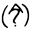
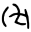
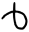
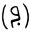
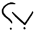
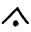
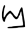
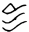
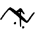
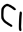
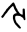
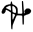
