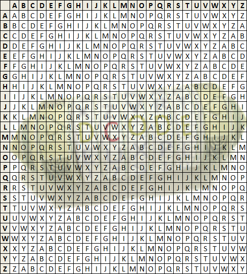

# Rozier Cipher

> Source: [https://www.dcode.fr/rozier-cipher](https://www.dcode.fr/rozier-cipher)
> Retrieved: 2026-08-08
> Attribution: dCode.fr (CC BY notice on the source page).
> Reference-only extract: no converter, solver, API, or implementation code.

## How to encrypt using Rozier cipher?

The Rozier cipher is a variant of the Vigenère cipher . To encrypt a message, locate, in a square of vigenère , the column of the letter of the plain message, go down until you find the letter of the key, then move horizontally until you locate the letter that follows in the key, and finally go up horizontally to read the letter of the column which is the encrypted letter.

Example: To code ROZIER with the key DCODE , start with the first letter R by locating the column R , go down to D (first letter of the key), move on the line until find C (second letter of the key) and go up to read the name of the column Q which is the first encrypted letter. The complete coded message is QAOJDQ

## How to decrypt Rozier cipher?

Using Vigenère 's square, locate the column of the Nth encrypted letter, go down until you find the letter in position N+1 of the key, locate on the line found the letter in position N of the key, and go up in the column to note the plain letter.

Example: To decode QAOJDQ encrypted with the key DCODE , start with the first letter Q by locating the column Q , go down to C (second letter of the key), move on the line until to find D (first letter of the key) and go up to read the name of the column R which is the first letter of the plain message. The full message is ROZIER

## How to recognize a Rozier ciphertext?

The Rozier cipher is a variant of Vigenere from which it takes all the cryptanalysis characteristics.

The notions of flowers, color, roses and the rosebush ( Rozier homophone in French) are clues.

## What is the difference between Rozier's cipher and Vigenere's cipher?

There is in fact very little difference between Rozier and Vigenere , the encryption of Rozier is identical to an encryption of Vigenère except for a change of key. Indeed, any Rozier encryption of the message M with a key C1, corresponds to Vigenère encryption of the message M a key C2.

## How to convert a Rozier key to a Vigenere Key?

From a Rozier key, the Vigenère key is calculated as follows: for each letter in the Rozier key, calculate rank of the next letter - rank of the letter ( modulo 26 ) . The letter of the key corresponds to the letter in the alphabet with the calculated rank. (The rank is from A = 0, B = 1 ...)

Example: If Rozier 's key is KEY (K is rank 10, E = 4, Y = 24) (E-K)% 26 = (4-10)% 26 = 20 = U (Y-E) % 26 = (24-4)% 26 = 20 = U (K-Y)% 26 = (10-24)% 26 = 12 = M The corresponding Vigenère key is UUM .

## How to decipher Rozier without key?

Use the Vigenere solver on dCode

## Reference Images

