# Flag Semaphore

> Source: [https://www.dcode.fr/semaphore-flag](https://www.dcode.fr/semaphore-flag)
> Retrieved: 2026-08-08
> Attribution: dCode.fr (CC BY notice on the source page).
> Reference-only extract: no converter, solver, API, or implementation code.

## What is the semaphore alphabet? (Definition)

The semaphore alphabet is a standardized visual communication code using two flags held at arm's length, whose angular positions represent characters.

It was developed and standardized by navies in the 19th century to transmit messages over long distances between ships or between a ship and the mainland, and it remains recognized as an international convention.

## How to encrypt using Semaphore cipher?

Semaphore encoding uses two flags (often the red and yellow Oscar flag , though this is not mandatory) manipulated by a person standing with outstretched arms to maximize the readability of the angles.

Each letter A–Z corresponds to a combination of arm positions.

A B C D E F G H I J K L M N O P Q R S T U V W X Y Z dCode.fr

A B C D E F G H I J K L M N O P Q R S T U V W X Y Z dCode.fr

Example: ' FLAG ' translates to (front view)

The numbers 1234567890 are encoded using first the Numbers signal (toggle signal), then the letters A through K, which serve as values from 1 to 0; to return to the letters, the user emits the Letters signal.

There are 5 special flags :

which signals a pause, a space, a rest, sometimes the end of the message

which indicates a switch from letters to digits

(= J ) that indicates a switch from digits to letters

which indicates an error or danger ( ⚠ )

which indicates an annulation (ignore/disregard previous signal) ( 🗙 )

Reference figures are always presented in receive mode: the user sending must imagine the character seen from behind.

## How to decrypt Semaphore cipher?

The deciphering process involves comparing the pair of observed angles with the standardized semaphore correspondence table to identify the associated letter.

Example: translates to SEMAPHORE

Be sure to take into account the special signals ( Numbers , Letters , Error , Cancel , Space ) which modify the interpretation of the following characters.

## How to recognize a Semaphore ciphertext?

A semaphore message is identified by a person holding two elongated objects ( flags , sticks, lamps) with outstretched arms, oriented at multiples of 45 ° from the vertical: (0, 45, 90, 135, 180, 225, 270, 315, 360).

Any visual reference to a maritime or nautical context (boats, ships), an aerial context (airplanes, aircraft), scouting, or to places where flags are used constitutes a further clue.

Sometimes the figure and the flags are simplified or removed to focus on the angles; in this case, the symbols resemble clock hands.

## What are the variants of the Semaphore flag cipher?

A visual variation involves representing arm positions with clock hands (sometimes called a clock semaphore ), where each hand acts as a flag set to hours, half-hours, or quarter-hours.

Some games or puzzles use flags with only two positions to encode Morse code ; this is no longer semaphore but a principle similar to wig-wag (binary dot/dash signaling).

The International Code of Signals (CISM) uses colored flags different from semaphore : they encode standardized words or messages, not letters by arm positions.

## What are the limits to using the semaphore alphabet?

The semaphore alphabet is limited by visibility (fog, rain, backlighting, night), the distance between transmitter and receiver, and the physical fatigue of the user, who must maintain precise positions.

The data rate remains moderate (a few characters per second at most), making the transmission of very long messages less efficient than radio communication.

A trained operator can transmit approximately 6 to 12 characters per minute depending on the distance, visibility, and complexity of the message.

Before radio, chains of human semaphores were sometimes used during naval exercises to relay a message over several kilometers, with each operator visually reproducing the received signal.

## How to learn the semaphore alphabet?

Learning requires memorizing the table of positions and then practicing regularly. The user can practice in front of a mirror, work with a partner alternating sending and receiving, or use a specialized guide presenting combinations and progressive exercises here (affiliate link)

## Is the semaphore alphabet still used today?

Despite the widespread use of wireless communications, the semaphore remains employed in specific contexts: naval training, ceremonies, cadet and scout exercises, emergency situations where radio is unavailable, or discreet short-range communications.

## When was Semaphore flags alphabet invented?

The two- flag semaphore system spread to navies in the mid-19th century (around the 1860s), mainly from British work, inspired by earlier Chappe-type optical telegraphs.

## Reference Images

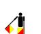
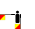
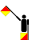
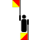
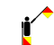
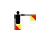
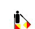
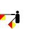
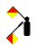
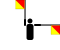
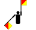
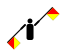
