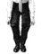
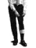
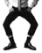

# Semaphore Trousers Cipher

> Source: [https://www.dcode.fr/semaphore-trousers-cipher](https://www.dcode.fr/semaphore-trousers-cipher)
> Retrieved: 2026-08-08
> Attribution: dCode.fr (CC BY notice on the source page).
> Reference-only extract: no converter, solver, API, or implementation code.

## How to encrypt using Semaphore Trousers cipher?

The principle of Semaphore Trousers encryption is identical to that of the semaphore alphabet. Each letter or number corresponds to a position of the legs and pants/jeans.

Example: DCODE is translated

## How to decrypt Semaphore Trousers cipher?

The decryption is identical to that of the semaphore alphabet : each position of the legs and pants corresponds to a letter or a number.

## How to recognize a Semaphore Trousers ciphertext?

The message may look like a dance or a leg position random sequence. The position of the trousers can help.

## Why creating Semaphore Trousers code?

According to here

The art known as Semaphore Trousers is rapidly gaining popularity and stands out as the only way for quality people to communicate at a time when background noise levels reach peak. As a general rule, during exuberant festivals, attempts to be heard above the general hubbub can be exasperating and, more often, completely futile. Within a week, and with a minimum of effort, it is possible to acquire a very good practice. On the floor of a crowded cocktail, people will be able to communicate their deepest thoughts and needs to most individuals, using nothing more than the flexibility of their physique and the flexibility of the rough fabric of their pants. Certainly there is no spectacle more touching than a man dressed with a serge and three square meters of waxed floor to perfect the movements adapted in harmony.

After years of practice and patience, carefully orchestrated movements can transcend simple practice and approach a level close to art. But no matter what level a person want to pursue the practice of Semaphore Trousers, in everyday life, it will be a valuable aid for communication a socially adapted use for business and especially for pleasure.

## Reference Images

