# Sheikah Language

> Source: [https://www.dcode.fr/sheikah-language](https://www.dcode.fr/sheikah-language)
> Retrieved: 2026-08-08
> Attribution: dCode.fr (CC BY notice on the source page).
> Reference-only extract: no converter, solver, API, or implementation code.

## What is the Sheikah language? (Definition)

Sheikah is a fictional writing system found in the world of The Legend of Zelda video games, primarily in Breath of the Wild.

It is not a language in the linguistic sense, but rather an alphanumeric substitution cipher: each letter and number of the Latin alphabet is replaced by a Sheikah graphic symbol.

## How to write in Sheikah?

The Sheikah script is based on a symbol substitution cipher. The Sheikah alphabet contains the 26 letters of the Latin alphabet, the 10 numbers, as well as some common punctuation marks: the character - (dash), the character . (period), the question mark ? and the exclamation mark ! .

A B C D E F G H I J K L M N O P Q R S T U V W X Y Z 0 1 2 3 4 5 6 7 8 9 ! - . ? dCode.fr

A B C D E F G H I J K L M N O P Q R S T U V W X Y Z 0 1 2 3 4 5 6 7 8 9 ! - . ? dCode.fr

Example: ZELDA is written

Some symbols can appear on a solid background or on an empty background without this changing their meaning.

## How to translate Sheikah language?

Deciphering the Sheikah script involves performing the reverse operation of encryption. Each Sheikah symbol is replaced by the Latin character (letter, number, or punctuation mark) to which it corresponds.

Example: is translated SHEIKAH .

## How to recognize Sheikah symbols?

Sheikah symbols are generally square and composed of straight horizontal and vertical lines, sometimes connected, as well as isolated dots.

Their graphic style evokes an abstract geometric alphabet, somewhat resembling a labyrinth.

In Breath of the Wild, these symbols appear on interfaces, terminals, and structures related to Sheikah technology. Any reference to the Zelda universe, Sheikah technology, or the character of Link is a strong clue.

NB:dCode uses the BOTW font created by Self Deletus

## What are the variants of the Sheikah language?

In the Zelda series, several alphabets have already been used, in particular the Hylian language, the Gerudo , the Goron , etc.

These systems are independent of each other and are based on different graphic conventions.

## Reference Images

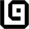
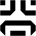
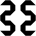
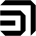
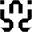
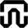
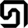
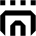
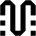
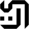
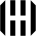
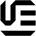
