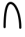
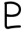
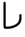
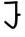
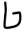
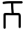
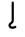
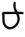
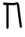
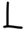

# Simlish Language

> Source: [https://www.dcode.fr/simlish-language](https://www.dcode.fr/simlish-language)
> Retrieved: 2026-08-08
> Attribution: dCode.fr (CC BY notice on the source page).
> Reference-only extract: no converter, solver, API, or implementation code.

## What is Simlish? (Definition)

The Simlish language is a language invented by Will Wright, from Maxis studio, for the game The Sims. This language was created to be untranslatable gibberish and to mean nothing in order to let it to players' imagination.

However, it contains many characters visually similar to the Latin alphabet, players tried to recognize which characters correspond to which letter of the alphabet, and tables of correspondences are available on the internet, dCode then transcribed them in this tool.

## How to write in Simlish?

The Simlish is supposed to mean nothing, any sequence of characters is then correctly written in Simlish .

However, since there is a similar related between Simlish symbols and the letters of the Latin alphabet, it is possible to translate certain words into English.

A B C D E F G H I J K L M N O P Q R S T U V W X Y Z dCode.fr

A B C D E F G H I J K L M N O P Q R S T U V W X Y Z dCode.fr

Lowercase letters have slightly different characters:

a b c d e f g h i j k l m n o p q r s t u v w x y z dCode.fr

a b c d e f g h i j k l m n o p q r s t u v w x y z dCode.fr

Example: SIMS is then written

Other than transliteration, there is no formal word-for-word translation. Meaning is conveyed through intonation, context, and the character's gestures in the game.

## How to translate Simlish text?

In video games The Sims, text and speech of the characters do usually mean nothing, no need to try to translate them, the Simlish was created especially to allow players to imagine the conversations.

Using the conversion charts created by the fans, it is possible to write words and phrases.

Example: translates to MAXIS

## How to recognize a Simlish ciphertext?

The Simlish is used in both The Sims or SimCity game series.

The symbols/glyphs are relatively close to the characters used in Latin or Greek.

## Reference Images

