# Stray Alphabet

> Source: [https://www.dcode.fr/stray-alphabet](https://www.dcode.fr/stray-alphabet)
> Retrieved: 2026-08-08
> Attribution: dCode.fr (CC BY notice on the source page).
> Reference-only extract: no converter, solver, API, or implementation code.

## What is the Stray alphabet? (Definition)

The video game Stray takes place in a city populated by robots during a post-humanity period. Several sets of symbols are regularly displayed in town and in dialogs. These are 2 alphabets imagined by the developers of the game.

## How to encrypt using Stray alphabet?

There are 2 alphabets in Stray , the first, called primary by the community, and the second secondary .

The primary alphabet has 26 signs replacing the 26 letters of the English alphabet: A B C D E F G H I J K L M N O P Q R S T U V W X Y Z dCode.fr

A B C D E F G H I J K L M N O P Q R S T U V W X Y Z dCode.fr

Example: STRAY translates to

The secondary alphabet has only 22 signs, the symbols corresponding to the letters Q , X , Y , Z never appear in the game. a b c d e f g h j i k l m n o p r s t u v w dCode.fr

a b c d e f g h j i k l m n o p r s t u v w dCode.fr

The usual Arabic numerals are present in the game, but sometimes a second set of symbols is used to represent the numbers from 1 to 9 (the zero 0 is not represented):

## How to decrypt Stray alphabet/cipher?

The decryption of the Stray alphabet consists in substituting the symbols by their equivalent letter in the English alphabet.

Example: translates to CAT

## How to recognize Stray symbols? (Identification)

Stray 's glyphs/characters are probably inspired by the Korean alphabet (Hangul).

Any references to cats/felines/stray cats/alley cats, the video game Stray , its characters (B12, Zurks, Momo, Doc, Zbaltazaar, Seamus, Clementine) or its developer Annapurna Interactive are clues.

## Reference Images

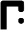
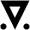
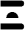
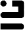
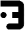
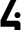
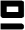
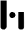
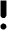
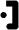
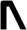
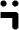
