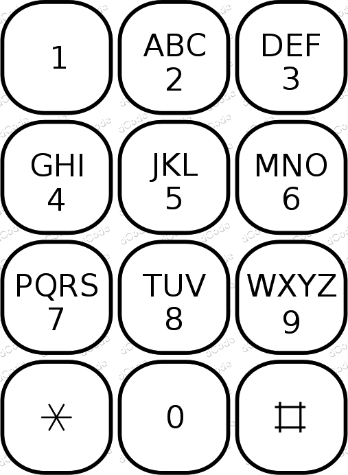

# T9 (Text Message)

> Source: [https://www.dcode.fr/t9-cipher](https://www.dcode.fr/t9-cipher)
> Retrieved: 2026-08-08
> Attribution: dCode.fr (CC BY notice on the source page).
> Reference-only extract: no converter, solver, API, or implementation code.

## What is T9? (Definition)

T9 (Text on 9 keys) is a predictive text system that allows you to type words by pressing each letter once on a phone's keypad.

It relies on a dictionary and an algorithm that guesses the most likely word based on the sequence of keys typed by the user.

## How to encrypt using T9 cipher?

To encode a message with the T9 , each letter is replaced by the number of the key that contains it on the keypad:

The user presses only once per letter.

Example: DCODE becomes 32633 on a T9 keyboard

Do not confuse the T9 with the multi-tap code (successively press the keys until you get the correct letter)

## How to decrypt T9 cipher?

T9 decoding is based on a dictionary: the sequence of numbers is compared to all known entries, and then the most probable word is suggested.

Without a dictionary, it is possible to perform an exhaustive search: each digit $ k $ corresponds to 3 or 4 letters, so a sequence can represent several combinations .

Example: 22 can yield AA,AB,AC,BA,BB,BC,CA,CB,CC

The code is sometimes used to create phonewords (mnemonic words for telephone numbers).

## How to recognize T9 ciphertext?

T9 encoding is recognizable because the message consists mainly of numbers containing the digits 2 to 9; the 0s and 1s are generally used for spaces or punctuation.

The T9 had other proprietary trade names like iTap, XT9, LetterWise or WordWise.

The notions of SMS writing/language or texting or autocorrect are clues as well as old mobile phones like Nokia 3210.

## What are the variants of the T9 cipher?

T9 differs from Multitap (ABC mode), a non-predictive method where the user presses the same key multiple times to obtain the correct letter.

Example: With this mode, DCODE is written as 3222666333

## What is a Textonym?

A textonym is a word that shares the exact same T9 key sequence as another word (encoding collision).

Example: COOL and BOOK are both encoded as 2665

These collisions are unavoidable because multiple letters are associated with the same key.

## When was T9 invented?

T9 was developed and patented in the mid-1990s by Tegic Communications. It gained popularity with the rise of SMS messaging on mobile phones in the late 1990s and early 2000s.

With the advent of smartphones with full touchscreen keyboards (Android and iPhone type), its use declined sharply, but it remains a useful way to encode messages.

## Reference Images

