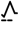
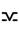
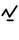
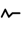
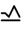
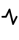
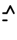
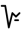
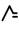

# Tenctonese Alphabet

> Source: [https://www.dcode.fr/tenctonese-alphabet](https://www.dcode.fr/tenctonese-alphabet)
> Retrieved: 2026-08-08
> Attribution: dCode.fr (CC BY notice on the source page).
> Reference-only extract: no converter, solver, API, or implementation code.

## What is Tenctonese? (Definition)

Tenctonese refers to a fictional extraterrestrial language and alphabet featured in the TV series and movie Alien Nation (1988).

## How to encrypt using Tenctonese alphabet?

The user can encrypt/write a message in Tenctonese by replacing each letter (or number) with its respective Tencton symbol. A B C D E F G H I J K L M N O P Q R S T U V W X Y Z dCode.fr

A B C D E F G H I J K L M N O P Q R S T U V W X Y Z dCode.fr

Example: ALIEN is written

These symbols are present mainly in this so-called printed form on papers or posters.

A variation of this alphabet is proposed in cursive writing a b c d e f g h i j k l m n o p q r s t u v w x y z dCode.fr

a b c d e f g h i j k l m n o p q r s t u v w x y z dCode.fr

(more rare, this alphabet is not complete in the series, it has been extrapolated assuming that the first 13 letters are symmetrical by central rotation of 180° to the last 13 letters)

Finally, the 10 digits and the & (ampersand) characters are encoded as follows: 0 1 2 3 4 5 6 7 8 9 & dCode.fr

0 1 2 3 4 5 6 7 8 9 & dCode.fr

## How to translate Tenctonese?

Deciphering involves replacing each Tenctonese symbol with its corresponding letter (or number) to reveal the original message (usually written in English).

Example: translates to NATION

## How to recognize a tenctonese ciphertext? (Identification)

The Tentone symbols, when joined together, form an electrocardiogram type trace (sinusoidal ECG).

Any references to the film Alien Nation (Immediate Future) or to the planet Tencton where the aliens (newcomers) come from are clues.

dCode used symbols made by Jeff Lee here

## Reference Images

