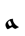
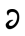
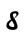
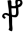
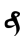
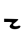
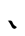
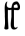
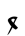

# Voynich Cipher

> Source: [https://www.dcode.fr/voynich-manuscript](https://www.dcode.fr/voynich-manuscript)
> Retrieved: 2026-08-08
> Attribution: dCode.fr (CC BY notice on the source page).
> Reference-only extract: no converter, solver, API, or implementation code.

## What is the Voynich cipher? (Definition)

The Voynich manuscript is a notebook, illustrated like a codex, written by an unknown (anonymous book, untitled and unsigned) in a language and / or writing that has not (to this day) been translated / deciphered. The name Voynich comes from Wilfrid M. Voynich who discovered this book at the beginning of the 20th century in a library in Frascati, Italy.

It is possible to buy replicas of the manuscript book here (affiliate link)

## How to encrypt using the Voynich cipher?

Even today nobody can translate the Voynich manuscript, but to facilitate translation, an alphabet called EVA (Extensible / European Voynich Alphabet) has been devised to create a correspondence between the symbols / characters of the manuscript and the letters of the Latin alphabet.

To write a message in English like Voynich , thanks to the alphabet EVA, it is necessary to transform each letter into a symbol according to the following correspondence table: a b c d e f g h i j k l m n o p q r s t u v x y z

a b c d e f g h i j k l m n o p q r s t u v x y z

Note the presence of only 25 letters and the absence of the W

Some letters can be written with a variant (a central line) and are 2 symbols for the letter K . Generally the symbol with the stroke is represented as an uppercase character.

## How to decrypt the Voynich cipher?

As previously mentioned, nobody has yet been able to translate Voynich , but transcription into the Latin alphabet is possible via the EVA alphabet. This is symbol-by-symbol translation according to the correspondence table above.

Example: is translated MANUSCRIPT

Several hypotheses have been put forward as to the writing and language used in the book, but no cryptanalysis, nor any proposal has, to date, convinced the experts. The main limitations are the total lack of clue as to the coding system used, the author or its purpose.

## How to recognize a Voynich ciphertext?

The message is made up of rounded symbols resembling Hebrew or Arabic characters.

Any reference to a manuscript, alchemy or occultism are clues.

## Who created the EVA alphabet?

Voynich 's alphabet was created by René Zandergen and Gabriel Landini.

## Reference Images

