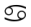
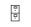
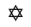
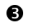
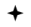
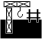

# Webdings Font

> Source: [https://www.dcode.fr/webdings-font](https://www.dcode.fr/webdings-font)
> Retrieved: 2026-08-08
> Attribution: dCode.fr (CC BY notice on the source page).
> Reference-only extract: no converter, solver, API, or implementation code.

## What is webdings? (Definition)

Webdings is a special typeface that replaces standard alphanumeric characters with dingbats/graphic symbols.

Created by Microsoft in 1997 and integrated into its Windows operating system and its Internet Explorer browser, it offered a variety of more or less useful pictograms.

Now deprecated, its symbols/icons/pictograms have, for some, been integrated into the Unicode standard.

## How to encrypt using Webdings cipher?

Webdings is a font with an equivalent for the majority of ASCII codes . Writing via Webdings therefore uses the substitution table offered by the Webdings font. Thus, a letter or a number is replaced by a symbol: A B C D E F G H I J K L M N O P Q R S T U V W X Y Z a b c d e f g h i j k l m n o p q r s t u v w x y z 0 1 2 3 4 5 6 7 8 9 dCode.fr

A B C D E F G H I J K L M N O P Q R S T U V W X Y Z a b c d e f g h i j k l m n o p q r s t u v w x y z 0 1 2 3 4 5 6 7 8 9 dCode.fr

Example: WEB is written

The complete correspondence table ( ASCII code , Webding Unicode symbol) is: 33 (!) 🕷 107 (k) 🛰 182 (¶) 🎟 34 (") 🕸 108 (l) 🟈 183 (·) 🎬 35 (#) 🕲 109 (m) 🕴 184 (¸) 📽 36 ($) 🕶 110 (n) ⚫ 185 (¹) 📹 37 (%) 🏆 111 (o) 🛥 186 (º) 📾 38 (&) 🎖 112 (p) 🚔 187 (») 📻 39 (') 🖇 113 (q) 🗘 188 (¼) 🎚 40 (() 🗨 114 (r) 🗙 189 (½) 🎛 41 ()) 🗩 115 (s) ❓ 190 (¾) 📺 42 (*) 🗰 116 (t) 🛲 191 (¿) 💻 43 (+) 🗱 117 (u) 🚇 192 (À) 🖥 44 (,) 🌶 118 (v) 🚍 193 (Á) 🖦 45 (-) 🎗 119 (w) ⛳ 194 (Â) 🖧 46 (.) 🙾 120 (x) 🛇 195 (Ã) 🕹 47 (/) 🙼 121 (y) ⊖ 196 (Ä) 🎮 48 (0) 🗕 122 (z) 🚭 197 (Å) 🕻 49 (1) 🗖 123 ({) 🗮 198 (Æ) 🕼 50 (2) 🗗 124 (|) | 199 (Ç) 📟 51 (3) ⏴ 125 (}) 🗯 200 (È) 🖁 52 (4) ⏵ 126 (~) 🗲 201 (É) 🖀 53 (5) ⏶ 128 (€) 🚹 202 (Ê) 🖨 54 (6) ⏷ 129 () 🚺 203 (Ë) 🖩 55 (7) ⏪ 130 (‚) 🛉 204 (Ì) 🖿 56 (8) ⏩ 131 (ƒ) 🛊 205 (Í) 🖪 57 (9) ⏮ 132 („) 🚼 206 (Î) 🗜 58 (:) ⏭ 133 (…) 👽 207 (Ï) 🔒 59 (;) ⏸ 134 (†) 🏋 208 (Ð) 🔓 60 (<) ⏹ 135 (‡) ⛷ 209 (Ñ) 🗝 61 (=) ⏺ 136 (ˆ) 🏂 210 (Ò) 📥 62 (>) 🗚 137 (‰) 🏌 211 (Ó) 📤 63 (?) 🗳 138 (Š) 🏊 212 (Ô) 🕳 64 (@) 🛠 139 (‹) 🏄 213 (Õ) 🌣 65 (A) 🏗 140 (Œ) 🏍 214 (Ö) 🌤 66 (B) 🏘 141 () 🏎 215 (×) 🌥 67 (C) 🏙 142 (Ž) 🚘 216 (Ø) 🌦 68 (D) 🏚 143 () 🗠 217 (Ù) ☁ 69 (E) 🏜 144 () 🛢 218 (Ú) 🌧 70 (F) 🏭 145 (‘) 💰 219 (Û) 🌨 71 (G) 🏛 146 (’) 🏷 220 (Ü) 🌩 72 (H) 🏠 147 (“) 💳 221 (Ý) 🌪 73 (I) 🏖 148 (”) 👪 222 (Þ) 🌬 74 (J) 🏝 149 (•) 🗡 223 (ß) 🌫 75 (K) 🛣 150 (–) 🗢 224 (à) 🌜 76 (L) 🔍 151 (—) 🗣 225 (á) 🌡 77 (M) 🏔 152 (˜) ✯ 226 (â) 🛋 78 (N) 👁 153 (™) 🖄 227 (ã) 🛏 79 (O) 👂 154 (š) 🖅 228 (ä) 🍽 80 (P) 🏞 155 (›) 🖃 229 (å) 🍸 81 (Q) 🏕 156 (œ) 🖆 230 (æ) 🛎 82 (R) 🛤 157 () 🖹 231 (ç) 🛍 83 (S) 🏟 158 (ž) 🖺 232 (è) Ⓟ 84 (T) 🛳 159 (Ÿ) 🖻 233 (é) ♿ 85 (U) 🕬 160 () 🕵 234 (ê) 🛆 86 (V) 🕫 161 (¡) 🕰 235 (ë) 🖈 87 (W) 🕨 162 (¢) 🖽 236 (ì) 🎓 88 (X) 🔈 163 (£) 🖾 237 (í) 🗤 89 (Y) 🎔 164 (¤) 📋 238 (î) 🗥 90 (Z) 🎕 165 (¥) 🗒 239 (ï) 🗦 91 ([) 🗬 166 (¦) 🗓 240 (ð) 🗧 92 (\) 🙽 167 (§) 📖 241 (ñ) 🛪 93 (]) 🗭 168 (¨) 📚 242 (ò) 🐿 94 (^) 🗪 169 (©) 🗞 243 (ó) 🐦 95 (_) 🗫 170 (ª) 🗟 244 (ô) 🐟 96 (`) ⮔ 171 («) 🗃 245 (õ) 🐕 97 (a) ✔ 172 (¬) 🗂 246 (ö) 🐈 98 (b) 🚲 173 (­) 🖼 247 (÷) 🙬 99 (c) □ 174 (®) 🎭 248 (ø) 🙮 100 (d) 🛡 175 (¯) 🎜 249 (ù) 🙭 101 (e) 📦 176 (°) 🎘 250 (ú) 🙯 102 (f) 🛱 177 (±) 🎙 251 (û) 🗺 103 (g) ■ 178 (²) 🎧 252 (ü) 🌍 104 (h) 🚑 179 (³) 💿 253 (ý) 🌏 105 (i) 🛈 180 (´) 🎞 254 (þ) 🌎 106 (j) 🛩 181 (µ) 📷 255 (ÿ) 🕊

33 (!) 🕷 107 (k) 🛰 182 (¶) 🎟 34 (") 🕸 108 (l) 🟈 183 (·) 🎬 35 (#) 🕲 109 (m) 🕴 184 (¸) 📽 36 ($) 🕶 110 (n) ⚫ 185 (¹) 📹 37 (%) 🏆 111 (o) 🛥 186 (º) 📾 38 (&) 🎖 112 (p) 🚔 187 (») 📻 39 (') 🖇 113 (q) 🗘 188 (¼) 🎚 40 (() 🗨 114 (r) 🗙 189 (½) 🎛 41 ()) 🗩 115 (s) ❓ 190 (¾) 📺 42 (*) 🗰 116 (t) 🛲 191 (¿) 💻 43 (+) 🗱 117 (u) 🚇 192 (À) 🖥 44 (,) 🌶 118 (v) 🚍 193 (Á) 🖦 45 (-) 🎗 119 (w) ⛳ 194 (Â) 🖧 46 (.) 🙾 120 (x) 🛇 195 (Ã) 🕹 47 (/) 🙼 121 (y) ⊖ 196 (Ä) 🎮 48 (0) 🗕 122 (z) 🚭 197 (Å) 🕻 49 (1) 🗖 123 ({) 🗮 198 (Æ) 🕼 50 (2) 🗗 124 (|) | 199 (Ç) 📟 51 (3) ⏴ 125 (}) 🗯 200 (È) 🖁 52 (4) ⏵ 126 (~) 🗲 201 (É) 🖀 53 (5) ⏶ 128 (€) 🚹 202 (Ê) 🖨 54 (6) ⏷ 129 () 🚺 203 (Ë) 🖩 55 (7) ⏪ 130 (‚) 🛉 204 (Ì) 🖿 56 (8) ⏩ 131 (ƒ) 🛊 205 (Í) 🖪 57 (9) ⏮ 132 („) 🚼 206 (Î) 🗜 58 (:) ⏭ 133 (…) 👽 207 (Ï) 🔒 59 (;) ⏸ 134 (†) 🏋 208 (Ð) 🔓 60 (<) ⏹ 135 (‡) ⛷ 209 (Ñ) 🗝 61 (=) ⏺ 136 (ˆ) 🏂 210 (Ò) 📥 62 (>) 🗚 137 (‰) 🏌 211 (Ó) 📤 63 (?) 🗳 138 (Š) 🏊 212 (Ô) 🕳 64 (@) 🛠 139 (‹) 🏄 213 (Õ) 🌣 65 (A) 🏗 140 (Œ) 🏍 214 (Ö) 🌤 66 (B) 🏘 141 () 🏎 215 (×) 🌥 67 (C) 🏙 142 (Ž) 🚘 216 (Ø) 🌦 68 (D) 🏚 143 () 🗠 217 (Ù) ☁ 69 (E) 🏜 144 () 🛢 218 (Ú) 🌧 70 (F) 🏭 145 (‘) 💰 219 (Û) 🌨 71 (G) 🏛 146 (’) 🏷 220 (Ü) 🌩 72 (H) 🏠 147 (“) 💳 221 (Ý) 🌪 73 (I) 🏖 148 (”) 👪 222 (Þ) 🌬 74 (J) 🏝 149 (•) 🗡 223 (ß) 🌫 75 (K) 🛣 150 (–) 🗢 224 (à) 🌜 76 (L) 🔍 151 (—) 🗣 225 (á) 🌡 77 (M) 🏔 152 (˜) ✯ 226 (â) 🛋 78 (N) 👁 153 (™) 🖄 227 (ã) 🛏 79 (O) 👂 154 (š) 🖅 228 (ä) 🍽 80 (P) 🏞 155 (›) 🖃 229 (å) 🍸 81 (Q) 🏕 156 (œ) 🖆 230 (æ) 🛎 82 (R) 🛤 157 () 🖹 231 (ç) 🛍 83 (S) 🏟 158 (ž) 🖺 232 (è) Ⓟ 84 (T) 🛳 159 (Ÿ) 🖻 233 (é) ♿ 85 (U) 🕬 160 () 🕵 234 (ê) 🛆 86 (V) 🕫 161 (¡) 🕰 235 (ë) 🖈 87 (W) 🕨 162 (¢) 🖽 236 (ì) 🎓 88 (X) 🔈 163 (£) 🖾 237 (í) 🗤 89 (Y) 🎔 164 (¤) 📋 238 (î) 🗥 90 (Z) 🎕 165 (¥) 🗒 239 (ï) 🗦 91 ([) 🗬 166 (¦) 🗓 240 (ð) 🗧 92 (\) 🙽 167 (§) 📖 241 (ñ) 🛪 93 (]) 🗭 168 (¨) 📚 242 (ò) 🐿 94 (^) 🗪 169 (©) 🗞 243 (ó) 🐦 95 (_) 🗫 170 (ª) 🗟 244 (ô) 🐟 96 (`) ⮔ 171 («) 🗃 245 (õ) 🐕 97 (a) ✔ 172 (¬) 🗂 246 (ö) 🐈 98 (b) 🚲 173 (­) 🖼 247 (÷) 🙬 99 (c) □ 174 (®) 🎭 248 (ø) 🙮 100 (d) 🛡 175 (¯) 🎜 249 (ù) 🙭 101 (e) 📦 176 (°) 🎘 250 (ú) 🙯 102 (f) 🛱 177 (±) 🎙 251 (û) 🗺 103 (g) ■ 178 (²) 🎧 252 (ü) 🌍 104 (h) 🚑 179 (³) 💿 253 (ý) 🌏 105 (i) 🛈 180 (´) 🎞 254 (þ) 🌎 106 (j) 🛩 181 (µ) 📷 255 (ÿ) 🕊

## How to decrypt Webdings cipher?

Decryption requires the Webdings font, each symbol is replaced by the corresponding letter in English.

Example: is translated DINGBAT with webdings font

## Where to find Webdings symbols into Unicode?

Since Unicode version 7, a majority of pictograms (geometric symbols, arrows, ornaments, etc.) from Wingdings and Webdings were added to the Unicode code E00x series E0Ax for Wingdings and E0Bx to E18x for Webdings .

Unicode includes Webdings pictograms of this categories: GUI Symbols, Playback buttons, Terrain icons, Vacation, Transportation, Humans, Sports, Business, Social, E-Mails, Office, Cultural Activities, Recording and filming, Telecommunication services and devices, Weather symbols or Accommodation etc.

## Reference Images

