# Wingdings 2 Font

> Source: [https://www.dcode.fr/wingdings-2-font](https://www.dcode.fr/wingdings-2-font)
> Retrieved: 2026-08-08
> Attribution: dCode.fr (CC BY notice on the source page).
> Reference-only extract: no converter, solver, API, or implementation code.

## What is Wingdings 2? (Definition)

Wingdings 2 is the name of a TrueType font (TTF) available on the Windows operating system from the 2000s.

Wingdings is a collection of pictograms often used to illustrate documents in Microsoft Word.

This is version 2, which complements Wingdings 1 (and Wingdings 3).

## How to encrypt using Wingdings 2 cipher?

A message written with the Wingdings2 font is made up of symbols replacing ASCII characters.

The Wingdings2 font is approximately counts 200 characters including symbols for the 94 printable ASCII characters: ! " # $ % & ' ( ) * + , - . / 0 1 2 3 4 5 6 7 8 9 : ; < = > ? @ A B C D E F G H I J K L M N O P Q R S T U V W X Y Z [ \ ] ^ _ ` a b c d e f g h i j k l m n o p q r s t u v w x y z { | } ~ dCode.fr

! " # $ % & ' ( ) * + , - . / 0 1 2 3 4 5 6 7 8 9 : ; < = > ? @ A B C D E F G H I J K L M N O P Q R S T U V W X Y Z [ \ ] ^ _ ` a b c d e f g h i j k l m n o p q r s t u v w x y z { | } ~ dCode.fr

Example: dCode is written

## How to decrypt Wingdings 2 cipher?

Decryption is a substitution of the symbols of the Wingdings2 character font by the ASCII characters.

Example: ⮽❺🖣👈⑥🖢 is decoded SyMBoL

## How to recognize the Wingdings 2 font?

The characters are either pictograms relating to the office (pens, scissors, telephones, paper, fax, mouse, etc.), or drawings of white or black hands, pointing a finger in the 4 directions (up, down, left, right ), or form icons (checkboxes), ornamental symbols (🙦), or numbers surrounded by a circle.

All the symbols / glyphs of the Wingdings2 font have been integrated to the Unicode standard (which therefore allows increased compatibility and inter-site copy-paste):

🖊🖋🖌🖍✄✀🕾🕽🗅🗆🗇🗈🗉🗊🗋🗌🗍📋🗑🗔🖵🖶🖷🖸🖭🖯🖱🖒🖓🖘🖙🖚🖛

👈👉🖜🖝🖞🖟🖠🖡👆👇🖢🖣🖑🗴🗸🗵☑⮽☒⮾⮿🛇⦸🙱🙴🙲🙳‽🙹🙺🙻

🙦🙤🙥🙧🙚🙘🙙🙛⓪①②③④⑤⑥⑦⑧⑨⑩⓿❶❷❸❹❺❻❼❽❾❿

## Reference Images

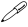

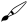
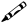
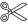
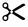
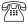
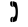
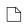
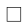
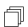
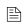
