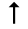
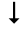
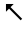
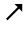
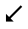
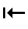
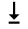

# Wingdings 3 Font

> Source: [https://www.dcode.fr/wingdings-3-font](https://www.dcode.fr/wingdings-3-font)
> Retrieved: 2026-08-08
> Attribution: dCode.fr (CC BY notice on the source page).
> Reference-only extract: no converter, solver, API, or implementation code.

## What is Wingdings 3? (Definition)

Wingdings 3 is a font, proposed in TrueType font (TTF) format on Windows operating systems in the 2000s.

Created to overcome the lack of pictograms, it is often associated with the Microsoft Word program.

This is version 3, which complements Wingdings 1 and Wingdings 2.

## How to encrypt using Wingdings 3 cipher?

A message written with the Wingdings3 font is made up of symbols replacing ASCII characters.

The Wingdings3 font is approximately 200 characters long, including the 94 ASCII characters that are printable: ! " # $ % & ' ( ) * + , - . / 0 1 2 3 4 5 6 7 8 9 : ; < = > ? @ A B C D E F G H I J K L M N O P Q R S T U V W X Y Z [ \ ] ^ _ ` a b c d e f g h i j k l m n o p q r s t u v w x y z { | } ~ dCode.fr

! " # $ % & ' ( ) * + , - . / 0 1 2 3 4 5 6 7 8 9 : ; < = > ? @ A B C D E F G H I J K L M N O P Q R S T U V W X Y Z [ \ ] ^ _ ` a b c d e f g h i j k l m n o p q r s t u v w x y z { | } ~ dCode.fr

Example: dCode is written

## How to decrypt Wingdings 3 cipher?

Decryption is a substitution of the symbols of the Wingdings3 character font by the ASCII characters.

Example: ⍽🡓🡘🡒🢪🡓🡘🡒▽ is decoded ' Wingdings '

## How to recognize the Wingdings 3 font?

The characters are either pictograms mainly grouping arrows (single arrow, double arrow, rounded, curved, etc.) or triangles (white or black) oriented in the 8 directions (up, down, right, left and the 4 diagonals)

All the symbols / glyphs of the Wingdings3 font have been integrated into Unicode (therefore cross-site compatible by copy and paste): ⭠⭢⭡⭣⭦⭧⭩⭨⭰⭲⭱⭳⭶⭸⭻⭽⭤⭥⭪⭬⭫⭭⭍⮠⮡⮢⮣⮤⮥⮦⮧⮐⮑⮒⮓⮀⮃⭾⭿⮄⮆⮅⮇⮏⮍⮎⮌⭮⭯ ⎋⌤⌃⌥␣⍽⇪⮸🢠🢡🢢🢣🢤🢥🢦🢧🢨🢩🢪🢫🡐🡒🡑🡓🡔🡕🡗🡖🡘🡙▲▼△▽◀▶◁▷◣◢◤◥🞀🞂🞁

## Reference Images

