# Wingdings Font

> Source: [https://www.dcode.fr/wingdings-font](https://www.dcode.fr/wingdings-font)
> Retrieved: 2026-08-08
> Attribution: dCode.fr (CC BY notice on the source page).
> Reference-only extract: no converter, solver, API, or implementation code.

## What is Wingdings? (Definition)

Wingdings is the name given to a typeface (font) owned by Microsoft, which is installed by default on Windows operating systems. Wingdings does not represent letters or numbers but contains, instead of the classic characters (Latin alphabet/ASCII code), a series of about 200 symbols/dingbats/icons.

## How to write in Wingdings?

The conversion uses the substitution table from the Wingdings font. Each letter/character ( ASCII code ) is replaced by a symbol according to a correspondence alphabet (see below).

Example: DCODE is written ( Wingding images) or 👎👍🏳👎☜ ( Unicode )

## How to translate Wingdings?

Translation into English requires the Wingdings font, each symbol is replaced by the corresponding letter.

Example: The 3 wing dings characters or 🕈🖐☠ corresponds to the 3 letters W,I,N in English

## What is the correspondence of Wingdings symbols?

Letters and digits/numbers writing it made through the symbols: A B C D E F G H I J K L M N O P Q R S T U V W X Y Z a b c d e f g h i j k l m n o p q r s t u v w x y z 0 1 2 3 4 5 6 7 8 9 dCode.fr

A B C D E F G H I J K L M N O P Q R S T U V W X Y Z a b c d e f g h i j k l m n o p q r s t u v w x y z 0 1 2 3 4 5 6 7 8 9 dCode.fr

## How to recognize the Wingdings font?

The Wingdings font has a variety of pictograms, but the common letters represent hands, astronomical symbols , crosses, squares, or circles.

In the video game Undertale (and its anagram game Deltarune), the character W. D. Gaster has cryptic dialogue using Wingdings characters.

There are several other similar fonts:

— Webdings : Another symbol font created by Microsoft.

— Zapf Dingbats: An older creation also focused on pictograms.

— Symbol Font : A collection containing mathematical characters and icons.

## Where to find Wingdings symbols in Unicode?

From version 7 on Unicode , a majority of Wingdings pictograms, including geometric symbols, arrows, ornaments, etc. Have been added to some Unicode blocks, for example in code series E00x to E0Ax.

There remain some symbols whose correspondence is not clear.

## What is the Q33NY hoax?

After the attacks of September 11, 2001, conspirators noticed that the dingbats corresponding to Q33NY in the Wingdings police were respectively [airplane, building, building, skull, Jewish star]. Q33 would be the name of the plane and NY would be NewYork .

This association is pure coincidence, and the symbols have since been modified by Microsoft to prevent the spread of fake news.

## Reference Images

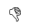
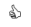
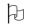
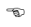
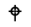
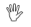
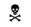
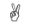
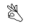
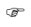
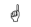
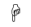
