# Zodiac Killer Cipher

> Source: [https://www.dcode.fr/zodiac-killer-cipher](https://www.dcode.fr/zodiac-killer-cipher)
> Retrieved: 2026-08-08
> Attribution: dCode.fr (CC BY notice on the source page).
> Reference-only extract: no converter, solver, API, or implementation code.

## What is the Zodiac cipher? (Definition)

The Zodiac cipher refers to a series of encryption systems used by a serial killer active in the San Francisco Bay Area (California, USA) in the late 1960s and early 1970s. The name Zodiac is the one the criminal gave himself by signing his letters with a symbol in the shape of a cross inscribed in a circle.

## Who is the Zodiac killer?

The Zodiac Killer is the nickname given to an unidentified criminal who committed a series of deadly attacks in the United States between 1968 and 1969.

His identity has never been confirmed despite numerous police investigations, from the FBI, and subsequent forensic analyses, and the case officially remains unsolved.

## What are Zodiac letters?

The Zodiac sent at least 17 letters to newspapers and local authorities. Some contained claims of responsibility or details about the crimes, and four of them included cryptograms composed of symbols: Z408, Z340, Z32, and Z13 (named after their length). Z408 was solved in 1969, Z340 in December 2020 by a team of cryptanalysts, while Z13 and Z32 remain unsolved.

## How to encrypt a message like the Zodiac cipher?

Messages Z408 and Z340 are based on homophonic substitution : the same letter can be represented by several different symbols.

Example: A can be encoded by or or in Z408

In Z340, this substitution is followed by a transposition of the characters into a 17-column grid, with reading performed along a predefined diagonal path.

The other cryptograms (Z32 and Z13) use visually similar symbols, but their alphabets and exact methods may differ.

The letters J , Q , X & Z have no known equivalent in Z408, dCode uses an arbitrary symbol (present in Z340, Z32 or Z13).

The letters J , K , Q , X & Z have no known equivalent in Z340, dCode uses an arbitrary symbol (present in Z408, Z32 or Z13).

## How to decrypt a Zodiac-like cipher?

The decipherment of Z408 consists of solving a homophonic substitution : each symbol corresponds to a plaintext letter, and several symbols can represent the same letter.

Example: and both match T

For Z340, apply the same homophonic substitution logic, then reorder the resulting letters using a diagonal transposition (knight's move) in a 17-column grid: the first letter of the first row, then the third letter of the second row, then the fifth letter of the third row, and so on.

Z32 and Z13 probably do not use the same method or the same symbol-letter correspondences.

## What is the content of Z408?

The Z-408 cryptogram was sent on July 31, 1969, to three newspapers. It was solved within hours by Donald and Bettye Harden, a couple of teachers. The message was:

The translation that was made: I LIKE KILLING PEOPLE BECAUSE IT IS SO MUCH FUN IT IS MORE FUN THAN KILLING WILD GAME IN THE FORREST BECAUSE MAN IS THE MOST DANGEROUE ANAMAL OF ALL TO KILL SOMETHING GIVES ME THE MOST THRILLING EXPERENCE IT IS EVEN BETTER THAN GETTING YOUR ROCKS OFF WITH A GIRL THE BEST PART OF IT IS THAE WHEN I DIE I WILL BE REBORN IN PARADICE AND ALL THE I HAVE KILLED WILL BECOME MY SLAVES I WILL NOT GIVE YOU MY NAME BECAUSE YOU WILL TRY TO SLOI DOWN OR ATOP MY COLLECTIOG OF SLAVES FOR MY AFTERLIFE EBEORIETEMETHHPITI (solution found in August 1969, spelling mistakes left intact, the meaning of the last 18 characters never received a consensual interpretation).

## What is the content of Z340?

Crypto Z-340 was sent on November 8, 1969, and solved 51 years later in December 2020 here

The ciphertext is arranged in a 17-column grid. After solving the homophonic substitution , the letters must be rearranged using a 20-line diagonal knight's move transposition to obtain the readable message.

The Z340 message has been translated I HOPE YOU ARE HAVING LOTS OF FAN IN TRYING TO CATCH ME THAT WASNT ME ON THE TV SHOW WHICH BRINGO UP A POINT ABOUT ME I AM NOT AFRAID OF THE GAS CHAMBER BECAASE IT WILL SEND ME TO PARADLCE ALL THE SOOHER BECAUSE E NOW HAVE ENOUGH SLAVES TO WORV FOR ME WHERE EVERY ONE ELSE HAS NOTHING WHEN THEY REACH PARADICE SO THEY ARE AFRAID OF DEATH I AM NOT AFRAID BECAUSE I VNOW THAT MY NEW LIFE IS LIFE WILL BE AN EASY ONE IN PARADICE DEATH (solution proposed in December 2020, spelling mistakes left intact)

It is again a homophonic substitution but this time, the letters of the message have been transposed so as to read diagonally on 9 lines: the reading order is: → 1 10 19 28 37 46 55 64 73 82 91 100 109 118 127 136 145 137 146 → 2 11 20 29 38 47 56 65 74 83 92 101 110 119 128 120 129 138 147 → 3 12 21 30 39 48 57 66 75 84 93 102 111 103 112 121 130 139 148 4 13 22 31 40 49 58 67 76 85 94 86 95 104 113 122 131 140 149 5 14 23 32 41 50 59 68 77 69 78 87 96 105 114 123 132 141 150 6 15 24 33 42 51 60 52 61 70 79 88 97 106 115 124 133 142 151 7 16 25 34 43 35 44 53 62 71 80 89 98 107 116 125 134 143 152 8 17 26 18 27 36 45 54 63 72 81 90 99 108 117 126 135 144 153 9 154 163 172 181 190 199 208 217 226 235 244 301 302 303 304 305 306 285 293 155 164 173 182 191 200 209 218 227 236 245 253 261 269 277 270 278 286 294 156 165 174 183 192 201 210 219 228 237 246 254 262 255 263 271 279 287 295 157 166 175 184 193 202 211 220 229 238 247 239 248 256 264 272 280 288 296 158 167 176 185 194 203 212 221 230 222 231 240 257 265 273 281 289 297 159 168 177 186 195 204 213 249 205 214 223 232 241 250 258 266 274 282 290 298 160 169 178 187 196 188 197 206 215 224 233 242 251 259 267 275 283 291 299 161 170 179 171 180 189 198 207 216 225 234 243 252 260 268 276 284 292 300 162 310 309 308 307 311 312 313 314 316 315 318 317 319 320 321 322 325 324 323 327 326 335 334 333 332 331 330 329 328 336 337 338 339 340

→ 1 10 19 28 37 46 55 64 73 82 91 100 109 118 127 136 145 137 146 → 2 11 20 29 38 47 56 65 74 83 92 101 110 119 128 120 129 138 147 → 3 12 21 30 39 48 57 66 75 84 93 102 111 103 112 121 130 139 148 4 13 22 31 40 49 58 67 76 85 94 86 95 104 113 122 131 140 149 5 14 23 32 41 50 59 68 77 69 78 87 96 105 114 123 132 141 150 6 15 24 33 42 51 60 52 61 70 79 88 97 106 115 124 133 142 151 7 16 25 34 43 35 44 53 62 71 80 89 98 107 116 125 134 143 152 8 17 26 18 27 36 45 54 63 72 81 90 99 108 117 126 135 144 153 9 154 163 172 181 190 199 208 217 226 235 244 301 302 303 304 305 306 285 293 155 164 173 182 191 200 209 218 227 236 245 253 261 269 277 270 278 286 294 156 165 174 183 192 201 210 219 228 237 246 254 262 255 263 271 279 287 295 157 166 175 184 193 202 211 220 229 238 247 239 248 256 264 272 280 288 296 158 167 176 185 194 203 212 221 230 222 231 240 257 265 273 281 289 297 159 168 177 186 195 204 213 249 205 214 223 232 241 250 258 266 274 282 290 298 160 169 178 187 196 188 197 206 215 224 233 242 251 259 267 275 283 291 299 161 170 179 171 180 189 198 207 216 225 234 243 252 260 268 276 284 292 300 162 310 309 308 307 311 312 313 314 316 315 318 317 319 320 321 322 325 324 323 327 326 335 334 333 332 331 330 329 328 336 337 338 339 340

## What is the content of Z13?

The Z-13 cryptogram dates from April 20, 1970. It consists of only 13 symbols and is preceded by the phrase MY NAME IS , leading to the hypothesis that it might contain a name. It remains undeciphered to this day. The message is

## What is the content of Z32?

The Z-32 cryptogram was sent on June 26, 1970, accompanied by a map of the San Francisco Bay Area bearing the Zodiac symbol, possibly indicating a location.

Investigators have theorized that Z-32 might encode digital geographic coordinates, but no definitive solution has been found. The message is:

## What are the common points between Z408 and Z340?

Z408 and Z340 share the same family of methods ( homophonic substitution ), but their alphabets and lookup tables differ greatly.

z408 z340 z408 z340 z408 z340 z408 z340 W D L E Y N N E R S F A T T I T F S S A T G H O E E N A I I F G O A D O R I S B O E W O R U N E R E V E O L C X D B P I I A A E C M U R Z R L I D A O L T L T I S N T H W L A E H S N K U R M Y E T V E D A L S P I N T T I P Q N J S U R K N O Y B E

z408 z340 z408 z340 z408 z340 z408 z340 W D L E Y N N E R S F A T T I T F S S A T G H O E E N A I I F G O A D O R I S B O E W O R U N E R E V E O L C X D B P I I A A E C M U R Z R L I D A O L T L T I S N T H W L A E H S N K U R M Y E T V E D A L S P I N T T I P Q N J S U R K N O Y B E

Despite the graphically similar symbols, only five symbol→letter correspondences coincide between the two ciphers: (= N ), (= I ), (= A ), (= E ), (= I ).

The symbol present in Z13 does not appear in either of the two solved cryptograms.

## Reference Images

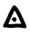
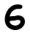
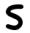
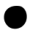

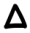
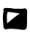
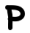
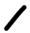
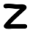
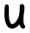
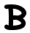
